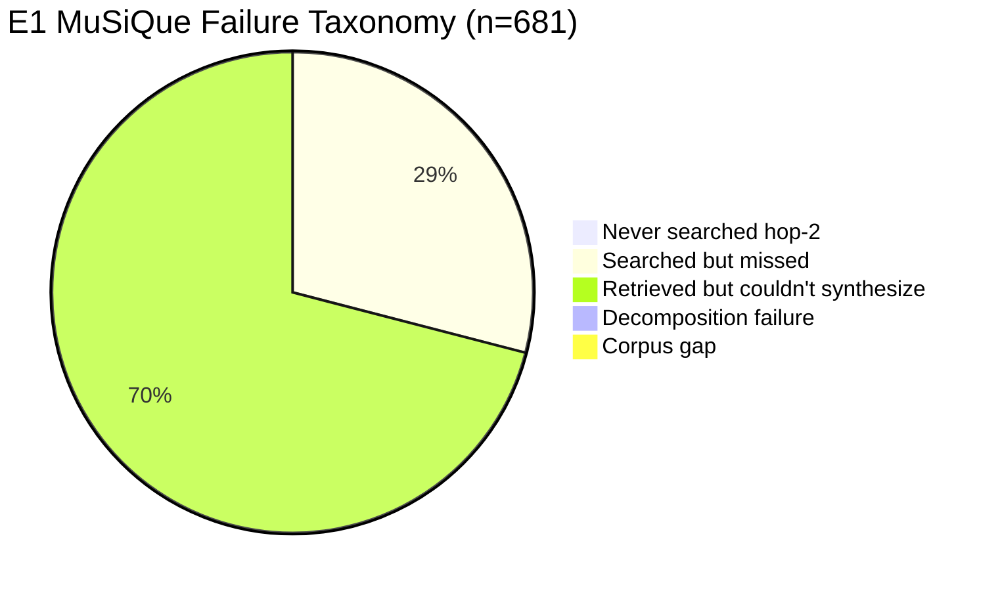
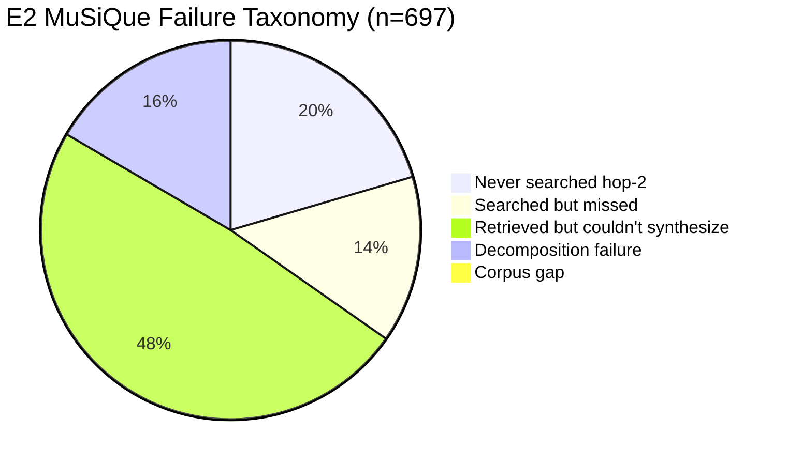
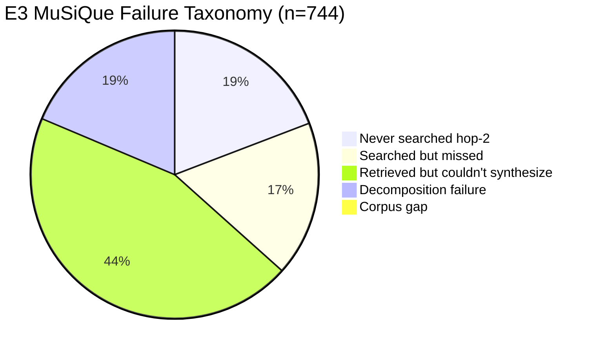
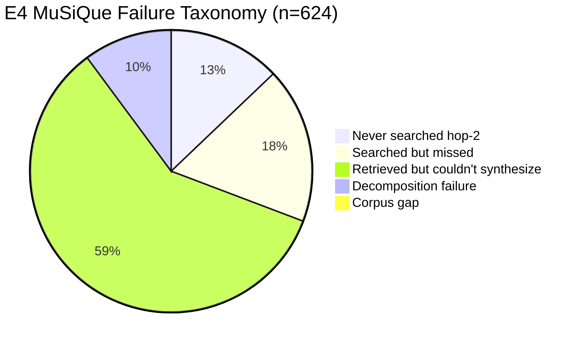

# A-RAG Reproduction: Unified-Judge Results (DeepSeek-R1-Distill-Qwen-32B)

Updated on 2026-02-17 after:
- Re-judging **E2** and **E3** with DeepSeek-R1-Distill-Qwen-32B
- Re-running **E1** on the correct ARAG per-dataset chunked corpus/index (not FlashRAG wiki18 flat)
- Applying evaluator sanitation for both `<think>` and `<thnk>` tags
- Computing **EM/F1** for E1-E4 from saved predictions
- Auditing **sample alignment** across E1-E4 with QID-set hashes

All experiments use 1000 questions per dataset across HotpotQA, MuSiQue, and 2WikiMultihop.

## Experiment Configurations

| ID | Generator | Embedding | Judge | Index Source | Hardware |
|---|---|---|---|---|---|
| **E1** | Qwen2.5-7B-Instruct | E5-base-v2 | DeepSeek-R1-Distill-Qwen-32B | ARAG chunked index | A100 (gen), H100 (eval) |
| **E2** | Qwen3-8B | E5-base-v2 | DeepSeek-R1-Distill-Qwen-32B | ARAG chunked index | A100 (gen), H100 (eval) |
| **E3** | Qwen3-8B | Qwen3-Embedding-0.6B | DeepSeek-R1-Distill-Qwen-32B | ARAG chunked index | A100 (gen), H100 (eval) |
| **E4** | Qwen3-30B-A3B | E5-base-v2 | DeepSeek-R1-Distill-Qwen-32B | ARAG chunked index | H100 (gen + eval) |
| **Ref** | GPT-4o-mini | paper default | GPT-4o-mini | paper default | API |

## Config Files

- E1: `configs/arag_qwen25_vllm_e5_{dataset}.yaml`
- E2: `configs/arag_qwen3_vllm_e5_{dataset}.yaml`
- E3: `configs/arag_qwen3_vllm_qwenemb_{dataset}.yaml`
- E4: `configs/arag_qwen3_30b_vllm_e5_{dataset}.yaml`

## Main Results: LLM-Accuracy (%)

| Dataset | E1 (Q2.5-7B) | E2 (Q3-8B+E5) | E3 (Q3-8B+QEmb) | E4 (Q3-30B+E5) | Paper (GPT-4o-mini) |
|---|---:|---:|---:|---:|---:|
| HotpotQA | 65.9 | 59.3 | 54.8 | **66.5** | 77.1 |
| MuSiQue | 31.9 | 30.3 | 25.6 | **37.6** | 46.1 |
| 2WikiMultihop | 48.4 | 47.5 | 39.8 | **56.9** | 60.2 |
| **Mean** | 48.7 | 45.7 | 40.1 | **53.7** | 61.1 |

## Main Results: Contain-Accuracy (%)

| Dataset | E1 (Q2.5-7B) | E2 (Q3-8B+E5) | E3 (Q3-8B+QEmb) | E4 (Q3-30B+E5) | Paper (GPT-4o-mini) |
|---|---:|---:|---:|---:|---:|
| HotpotQA | **68.3** | 59.4 | 55.4 | 67.7 | 74.0 |
| MuSiQue | 32.2 | 27.1 | 21.8 | **34.4** | 39.6 |
| 2WikiMultihop | 53.1 | 54.4 | 48.9 | **63.9** | 63.7 |
| **Mean** | 51.2 | 47.0 | 42.0 | **55.3** | 59.1 |

## Gap 2: EM/F1 (String-Matching on Saved Predictions)

Computed with `scripts/arag-single-agent-scaffold/04_eval_em_f1.py` on each `predictions.jsonl` (no re-generation).

| Dataset | Metric | E1 | E2 | E3 | E4 |
|---|---|---:|---:|---:|---:|
| HotpotQA | EM | 0.00 | 0.00 | 0.00 | 0.00 |
| HotpotQA | F1 | **4.26** | 1.61 | 1.58 | 1.37 |
| MuSiQue | EM | 0.00 | 0.00 | 0.00 | 0.00 |
| MuSiQue | F1 | **2.56** | 1.02 | 0.98 | 0.92 |
| 2WikiMultihop | EM | 0.00 | 0.00 | 0.00 | 0.00 |
| 2WikiMultihop | F1 | **4.13** | 1.54 | 1.46 | 1.41 |
| Mean | EM | 0.00 | 0.00 | 0.00 | 0.00 |
| Mean | F1 | **3.65** | 1.39 | 1.34 | 1.23 |

Notes:
- Values are percentages (`metric * 100`).
- EM is zero for all settings under this strict full-string comparison (predictions are generally long-form, not answer-only spans).

## Gap 3: Sample Alignment Audit (E1-E4)

Alignment check summary:
- Each dataset has exactly 1000 predictions and 1000 unique QIDs per experiment.
- For each dataset, QID sets are identical across E1, E2, E3, and E4.
- QID sets match the fixed ARAG question packs in:
  - `/projects/prjs1800/external/arag/data/hotpotqa/questions.json`
  - `/projects/prjs1800/external/arag/data/musique/questions.json`
  - `/projects/prjs1800/external/arag/data/2wikimultihop/questions.json`
- QID order in output files differs across experiments (due to concurrent execution), but set membership is identical.
- Subset-generation policy (random seed/stratification vs first-N) is not recorded in this repo; provenance is the fixed ARAG `questions.json` files above.

| Dataset | `questions.json` SHA256 | Sorted QID-set SHA256 |
|---|---|---|
| HotpotQA | `ecc641d532a4d2518f1ceb57627f2e41044e0c4fd07012bf0aaa02327dc770a9` | `f862c1f79262145275dbe07765d40029efddeed5cd317d78ba83222b09f45e0c` |
| MuSiQue | `42dfd487e7e08d0892ed94bd9e0d0e56744cd92239f41b190e156f563ab49fb4` | `351d2f4459de891224502bbcbd8e529b4ce758110a376cdcdbdebfa3491e7447` |
| 2WikiMultihop | `246e43fb624413e38e11e3a582d5945185a3290efe4c2adbe32af2f112b70ab8` | `a04ebb236e89b94b2e005fd79e9a9b74d15da4e1c90f33ab67578bf564c93788` |

## Efficiency (Average)

| Dataset | Metric | E1 | E2 | E3 | E4 |
|---|---|---:|---:|---:|---:|
| HotpotQA | Avg Loops | 3.33 | 2.44 | 2.53 | 2.66 |
| HotpotQA | Avg Retrieved Tokens | 2222.2 | 714.4 | 783.3 | 842.1 |
| MuSiQue | Avg Loops | 3.99 | 2.65 | 2.63 | 2.98 |
| MuSiQue | Avg Retrieved Tokens | 2584.0 | 751.1 | 803.7 | 873.2 |
| 2WikiMultihop | Avg Loops | 3.48 | 2.78 | 2.84 | 3.05 |
| 2WikiMultihop | Avg Retrieved Tokens | 1886.8 | 810.5 | 935.0 | 800.1 |

## Key Findings

1. Judge confound is removed for E1-E4: all now use DeepSeek-R1-Distill-Qwen-32B.
2. E4 remains the strongest overall configuration (best mean LLM-Acc and mean Contain-Acc).
3. E5-base-v2 still outperforms Qwen3-Embedding-0.6B for Qwen3-8B (E2 > E3 across all datasets).
4. Correcting E1 corpus/index changes its conclusions substantially; the prior FlashRAG-wiki18 E1 numbers were not comparable.
5. E1 reaches high containment but with much higher retrieval/tool-use cost (2-3x retrieved tokens vs E2/E3/E4).

## MuSiQue Failure Taxonomy (E1-E4)

Taxonomy computed on **failed MuSiQue samples only** (`llm_accuracy < 1`) using:
- MuSiQue gold decomposition (`musique_ans_v1.0_*`)
- Retrieved ARAG chunk traces (`retrieval_logs` + `trajectory`)
- Heuristic support-paragraph overlap matching

Category definitions:
- `never_searched_hop2`: hop-1 evidence found, but only one retrieval step before answering.
- `searched_but_missed`: multiple retrieval attempts, but support evidence still incomplete.
- `retrieved_but_couldnt_synthesize`: support evidence retrieved, but final answer still incorrect.
- `decomposition_failure`: query trajectory weakly aligned with decomposition hops.
- `corpus_gap`: gold answer string not found in ARAG MuSiQue chunk corpus.

| Experiment | Failed | Never Searched Hop-2 | Searched but Missed | Retrieved but Couldn't Synthesize | Decomposition Failure | Corpus Gap |
|---|---:|---:|---:|---:|---:|---:|
| E1 | 681 | 3 (0.4%) | 196 (28.8%) | 479 (70.3%) | 0 (0.0%) | 3 (0.4%) |
| E2 | 697 | 142 (20.4%) | 99 (14.2%) | 338 (48.5%) | 115 (16.5%) | 3 (0.4%) |
| E3 | 744 | 142 (19.1%) | 129 (17.3%) | 331 (44.5%) | 138 (18.6%) | 4 (0.5%) |
| E4 | 624 | 80 (12.8%) | 111 (17.8%) | 367 (58.8%) | 63 (10.1%) | 3 (0.5%) |

### E1 MuSiQue Failure Mix

### E2 MuSiQue Failure Mix

### E3 MuSiQue Failure Mix

### E4 MuSiQue Failure Mix

Raw analysis output:
- `/projects/prjs1800/msc-thesis/01-arag-reproduction/analysis/musique_failure_taxonomy.json`

## Result File Locations

- `results/qwen25-7b-instruct/{hotpotqa,musique,2wikimultihop}/predictions_eval_summary.json`
- `results/qwen3-8b-vllm/{hotpotqa,musique,2wikimultihop}/predictions_eval_summary.json`
- `results/qwen3-8b-qwen-emb-vllm/{hotpotqa,musique,2wikimultihop}/predictions_eval_summary.json`
- `results/qwen3-30b-e5-deepseekr1/{hotpotqa,musique,2wikimultihop}/predictions_eval_summary.json`
- `results/qwen25-7b-instruct/{hotpotqa,musique,2wikimultihop}/predictions_em_f1_summary.json`
- `results/qwen3-8b-vllm/{hotpotqa,musique,2wikimultihop}/predictions_em_f1_summary.json`
- `results/qwen3-8b-qwen-emb-vllm/{hotpotqa,musique,2wikimultihop}/predictions_em_f1_summary.json`
- `results/qwen3-30b-e5-deepseekr1/{hotpotqa,musique,2wikimultihop}/predictions_em_f1_summary.json`
- `analysis/gap2_gap3_audit.json`
