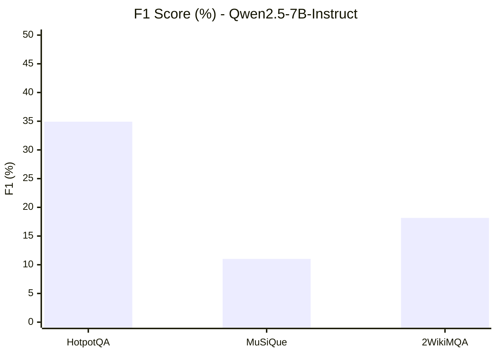
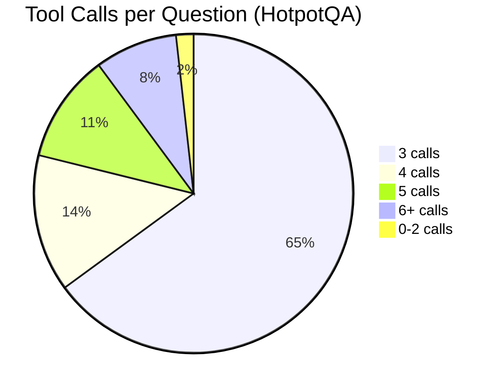

# Experiment A: Single-Agent A-RAG Reproduction

## Setup

- **Generator Model**: Qwen2.5-7B-Instruct (via vLLM, hermes tool-call parser)
- **Retrieval Corpus**: FlashRAG wiki18_100w (~21M passages)
- **Embedding Model**: E5-base-v2 (FAISS flat index)
- **Keyword Search**: SQLite FTS5
- **Agent Loop**: ReAct with tools: keyword_search, semantic_search, read_chunk, finish
- **Max Loops**: 10 | **Max Token Budget**: 128K | **Workers**: 4

## Results: Qwen2.5-7B-Instruct

### Answer Quality

| Metric | HotpotQA (n=7405) | MuSiQue (n=2417) | 2WikiMQA (n=12576) |
|---|---|---|---|
| **EM** | 25.67% | 4.43% | 13.93% |
| **F1** | 34.92% | 11.02% | 18.16% |
| **Precision** | 36.41% | 11.95% | 18.38% |
| **Recall** | 35.55% | 11.28% | 18.65% |
| **Contains Match** | 29.52% | 5.79% | 15.33% |
| **LLM Judge** | — | — | — |

### Retrieval Quality

| Metric | HotpotQA | MuSiQue | 2WikiMQA |
|---|---|---|---|
| **Retrieval Recall** | 43.6% | 13.5% | 36.4% |

### Agent Behavior

| Metric | HotpotQA | MuSiQue | 2WikiMQA |
|---|---|---|---|
| **Finish Rate** | 99.43% | 98.63% | 99.39% |
| **Avg Loops** | 4.54 | 4.91 | 4.89 |
| **Avg Tool Calls** | 3.67 | 3.99 | 4.02 |
| **Errors** | 0 | 0 | 0 |

### Comparison with A-RAG Paper (GPT-4o-mini)

| Dataset | Ours (Cont) | A-RAG Naive (Cont) | A-RAG Full (Cont) | Ours (F1) |
|---|---|---|---|---|
| MuSiQue | 5.8% | 38.5% | 39.6% | 11.0% |
| HotpotQA | 29.5% | 70.7% | 74.0% | 34.9% |
| 2WikiMQA | 15.3% | 62.4% | 63.7% | 18.2% |

## Charts

### F1 Score by Dataset

### Retrieval Recall vs Contains Match

```mermaid
xychart-beta
    title "Retrieval Recall vs Contains Match (%)"
    x-axis ["HotpotQA", "MuSiQue", "2WikiMQA"]
    y-axis "%" 0 --> 50
    bar "Retrieval Recall" [43.6, 13.5, 36.4]
    bar "Contains Match" [29.5, 5.8, 15.3]
```

### Answer Quality Breakdown

```mermaid
xychart-beta
    title "Answer Quality Metrics - Qwen2.5-7B-Instruct"
    x-axis ["HotpotQA", "MuSiQue", "2WikiMQA"]
    y-axis "Score (%)" 0 --> 40
    bar "EM" [25.67, 4.43, 13.93]
    bar "F1" [34.92, 11.02, 18.16]
    bar "Contains" [29.52, 5.79, 15.33]
```

### Gap Analysis: Ours vs A-RAG (Contains Match)

```mermaid
xychart-beta
    title "Contains Match: Ours vs A-RAG Full (GPT-4o-mini)"
    x-axis ["HotpotQA", "MuSiQue", "2WikiMQA"]
    y-axis "Contains Match (%)" 0 --> 80
    bar "Ours (Qwen2.5-7B)" [29.5, 5.8, 15.3]
    bar "A-RAG Full (GPT-4o-mini)" [74.0, 39.6, 63.7]
```

### Tool Call Distribution (HotpotQA)

## Analysis

### Root Cause: Retrieval Failure

The primary bottleneck is **retrieval recall**, not answer generation:

- MuSiQue retrieval recall is only **13.5%** — the gold answer appears in retrieved chunks for only 327/2417 questions
- Contains match cannot exceed retrieval recall (you can't answer what you never retrieved)
- **57-65% of questions use only 3 tool calls** (keyword -> semantic -> read_chunk = 1 search hop)
- MuSiQue requires 2-4 hops; HotpotQA requires 2 hops

### Contributing Factors

1. **Too few search hops**: Model does 1 hop then answers, instead of chaining searches
2. **Model gap**: Qwen2.5-7B-Instruct vs GPT-4o-mini — weaker at multi-step ReAct reasoning
3. **Search quality**: E5-base-v2 + FTS5 may miss entity-centric multi-hop queries

### Key Takeaway

> The gap to A-RAG is driven by retrieval (model fails to chain multi-hop searches),
> not by answer extraction. Improving the agent's search strategy or using a stronger
> model would have the highest impact.
