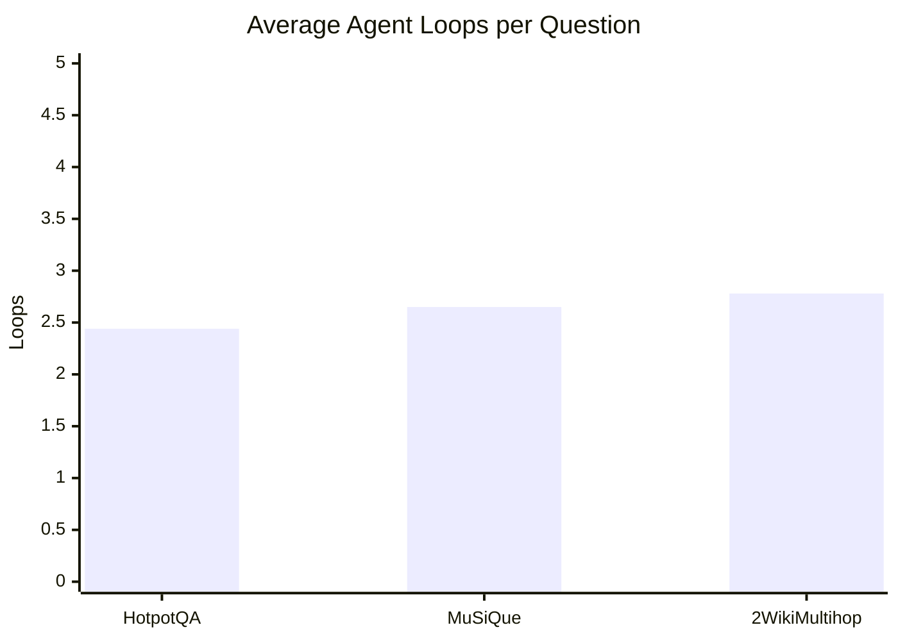
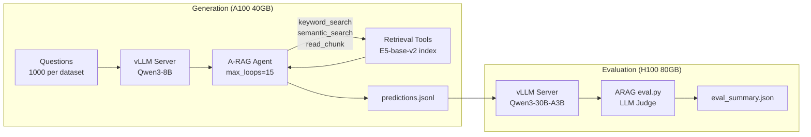

# A-RAG Reproduction Results: Qwen3-8B Backbone

## Experiment Setup

| Component | Original (Paper) | This Reproduction |
|-----------|------------------|-------------------|
| **Generator** | GPT-4o-mini (API) | Qwen3-8B via vLLM |
| **Embedding** | Qwen3-Embedding-0.6B | intfloat/e5-base-v2 |
| **LLM Judge** | GPT-4o-mini (API) | Qwen3-30B-A3B via vLLM |
| **Serving** | OpenAI API | vLLM 0.15.1 (Hermes tool parser) |
| **Hardware** | N/A (API) | 1x A100 40GB (gen), 1x H100 80GB (eval) |
| **Agent Config** | max_loops=15, budget=128k | max_loops=15, budget=128k |
| **Datasets** | 1000 questions each | 1000 questions each |

## Main Results

### Accuracy Comparison

| Dataset | Metric | GPT-4o-mini A-RAG (Paper) | Qwen3-8B A-RAG (Ours) |
|---------|--------|:-------------------------:|:----------------------:|
| **HotpotQA** | LLM-Acc | 77.1 | 53.2 |
| | Cont-Acc | 74.0 | 62.2 |
| **MuSiQue** | LLM-Acc | 46.1 | 32.0 |
| | Cont-Acc | 39.6 | 29.8 |
| **2WikiMultihop** | LLM-Acc | 60.2 | 43.1 |
| | Cont-Acc | 63.7 | 57.1 |

### LLM-Accuracy by Dataset

```mermaid
bar chart
    title LLM-Accuracy (%) — GPT-4o-mini vs Qwen3-8B
    x-axis ["HotpotQA", "MuSiQue", "2WikiMultihop"]
    y-axis "Accuracy (%)" 0 --> 100
    bar [77.1, 46.1, 60.2]
    bar [53.2, 32.0, 43.1]
```

```mermaid
xychart-beta
    title "LLM-Accuracy (%)"
    x-axis ["HotpotQA", "MuSiQue", "2WikiMultihop"]
    y-axis "Accuracy (%)" 0 --> 100
    bar [77.1, 46.1, 60.2]
    bar [53.2, 32.0, 43.1]
```



### Contain-Accuracy by Dataset

```mermaid
xychart-beta
    title "Contain-Accuracy (%)"
    x-axis ["HotpotQA", "MuSiQue", "2WikiMultihop"]
    y-axis "Accuracy (%)" 0 --> 100
    bar [74.0, 39.6, 63.7]
    bar [62.2, 29.8, 57.1]
```



### Efficiency Metrics (Qwen3-8B)



| Dataset | Avg Loops | Avg Retrieved Tokens | Answer Rate |
|---------|:---------:|:--------------------:|:-----------:|
| HotpotQA | 2.44 | 714 | 100% |
| MuSiQue | 2.65 | 751 | 100% |
| 2WikiMultihop | 2.78 | 811 | 100% |

## Pipeline Overview



## Notes

- **Performance gap** is expected: Qwen3-8B (8B params) vs GPT-4o-mini (proprietary, likely larger). The gap is smallest on Contain-Accuracy for HotpotQA (62.2 vs 74.0) and 2WikiMultihop (57.1 vs 63.7), suggesting the retrieval pipeline works well but answer synthesis quality differs.
- **Embedding difference**: E5-base-v2 vs Qwen3-Embedding-0.6B adds a second variable. Rebuilding indexes with Qwen3-Embedding-0.6B would isolate the generator as the sole variable.
- **Tool call reliability**: 1 parsing error across 3000 questions (0.03%) with the Hermes tool parser on vLLM. The `max_tokens=8192` setting accommodates Qwen3's thinking tokens.
- **Judge model**: Qwen3-30B-A3B (MoE, 3B active params) was used instead of GPT-4o-mini. LLM-Acc scores may differ from paper due to judge model differences.
