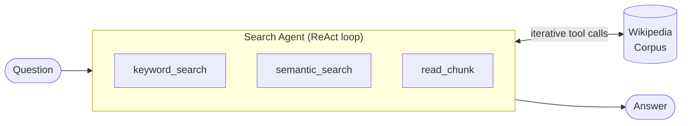
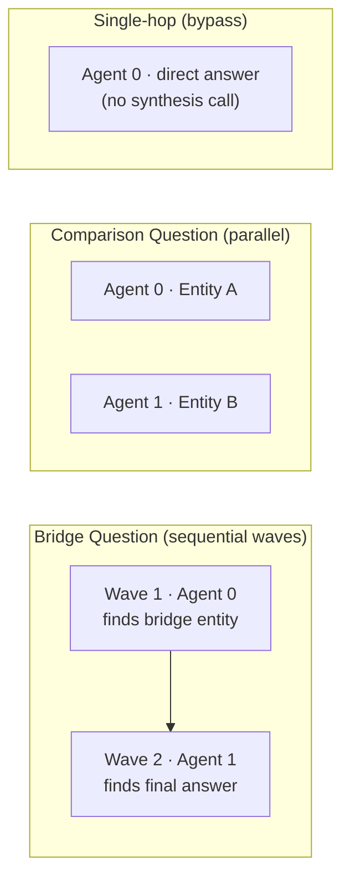
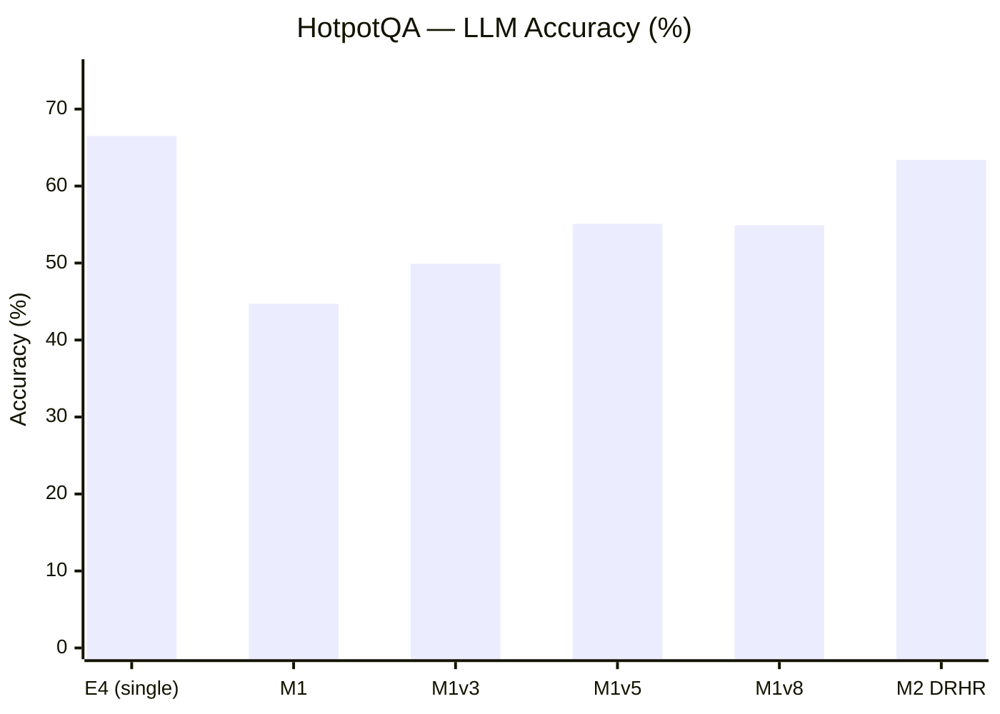
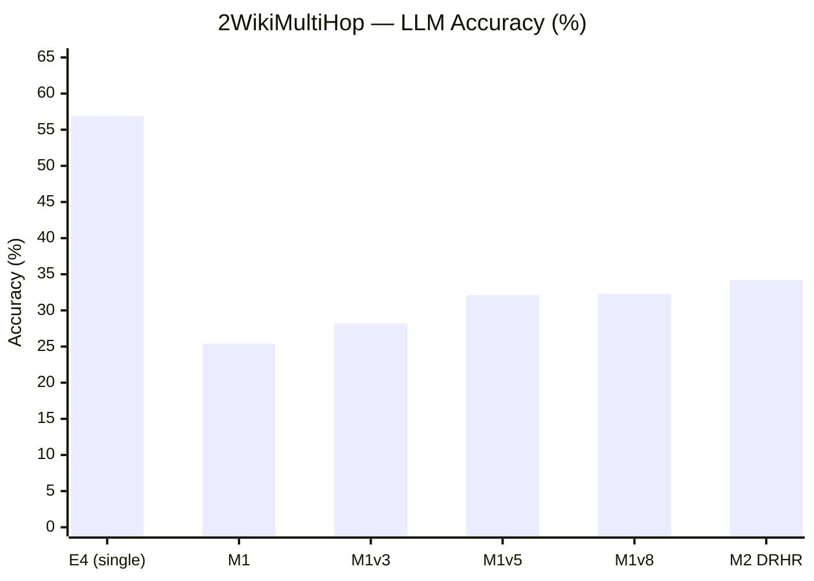
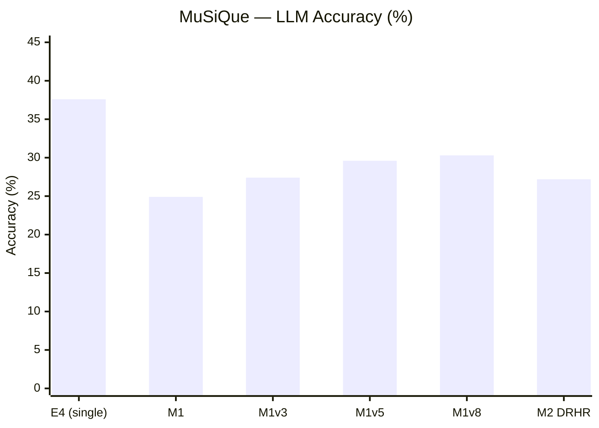
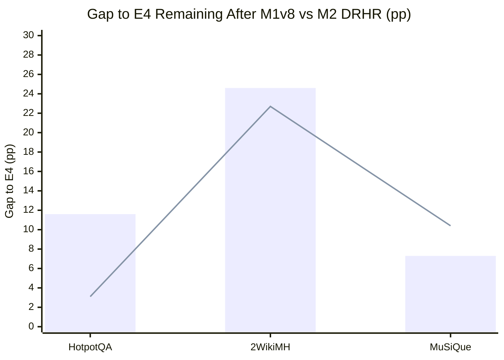
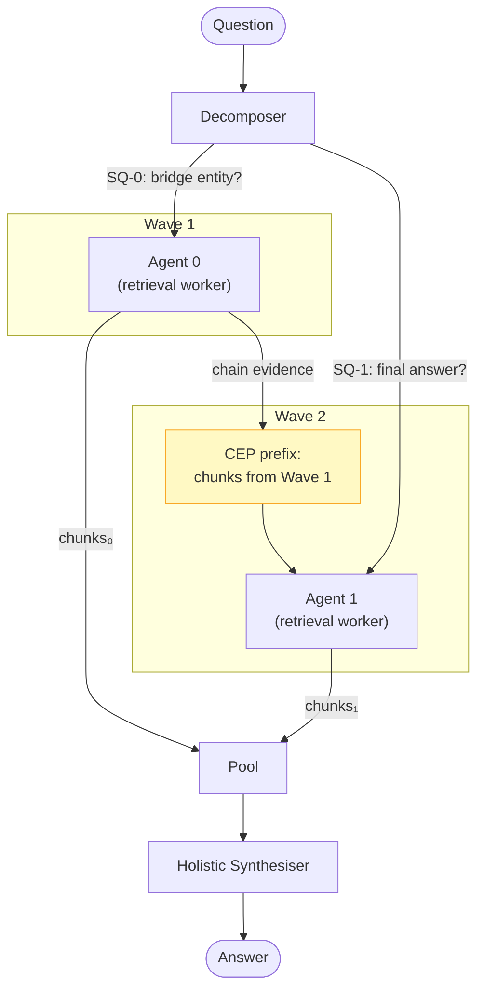
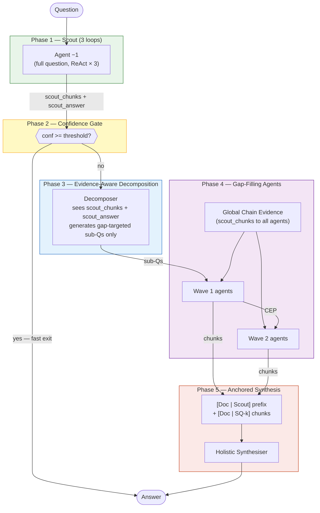
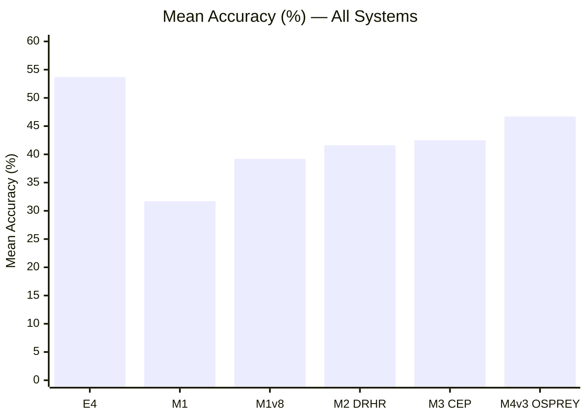

# MA²RAG — Multi-Agent Decomposed Retrieval, Holistic Reasoning

> **MSc Thesis Experiments** · University of Amsterdam · MultIX Lab · Spring 2026  
> Built on top of [A-RAG](https://arxiv.org/abs/2602.03442) (Du et al., 2026)

This repository contains the full experimental pipeline for **MA²RAG**: a multi-agent extension of agentic RAG that decomposes complex questions across specialised retrieval agents, then synthesises a final answer over the pooled evidence.

---

## Architecture Overview

### Baseline: E4 — Single-Agent A-RAG



---

### M1 — Sub-Answer Aggregation *(deprecated)*

Agents answer their sub-questions; the aggregator reconciles compressed sub-answers.


**Problem**: Compressed sub-answers lose information. If Agent 0 answers incorrectly, the aggregator inherits that error.

---

### M2 — DRHR: Decomposed Retrieval, Holistic Reasoning ✅

Agents are **pure retrieval workers** — their sub-answers are ignored. The synthesiser reasons directly over the raw evidence pool.


**Key insight**: Decomposition guides *retrieval*, not *reasoning*. Holistic synthesis over structured raw evidence avoids the information compression bottleneck.

---

## Dispatch & Wave Strategy

For **bridge** questions, agents run in sequential waves so each wave can use prior evidence. For **comparison** questions, agents run in parallel (one per entity).



---

## Results

### LLM Accuracy (%) — Qwen3-30B-A3B + E5-base-v2 + DeepSeek-R1 judge







### Full Results Table

| Version | HotpotQA | 2WikiMH | MuSiQue | **Mean** | Key Change |
|---------|:--------:|:-------:|:-------:|:--------:|------------|
| E4 *(single-agent baseline)* | 66.5 | 56.9 | 37.6 | **53.7** | Single ReAct agent, full iterative search |
| M1 | 44.7 | 25.4 | 24.9 | 31.7 | Multi-agent baseline; sub-answer aggregation |
| M1v3 | 49.9 | 28.2 | 27.4 | 35.2 | Full 1000-sample runs |
| M1v5 | 55.1 | 32.1 | 29.6 | 38.9 | Fix `finish()` leak; decisive aggregator; single-hop bypass |
| M1v6 | 55.9 | 27.7 | 30.3 | 38.0 | Unified evidence pool (regression on 2Wiki) |
| M1v7 | 51.5 | 23.6 | 29.6 | 34.9 | Per-entity sections (broken comparison instruction) |
| M1v8 | 54.9 | 32.3 | 30.3 | 39.2 | Fixed comparison; disabled self-verify |
| **M2 DRHR** | **63.4** | **34.2** | **27.2** | **41.6** | Holistic synthesis over raw evidence pool |

### M2 DRHR — Accuracy by Question Type

| Dataset | bridge | comparison | single_hop | n |
|---------|:------:|:----------:|:----------:|---|
| HotpotQA | 63.4% | 64.3% | 60.6% | 1000 |
| 2WikiMultiHop | **21.0%** | 48.6% | 22.2% | 1000 |
| MuSiQue | 27.4% | 33.3% | 19.2% | 1000 |

**Key finding**: 2Wiki bridge accuracy (21.0%) is the dominant failure mode — bridge agents retrieve without knowledge of what earlier agents found.

### Gaps to E4 Closed by M2


*Bars = M1v8 gap to E4; Line = M2 DRHR gap to E4*

---

## M1 → M2: What Changed

| Component | M1 | M2 DRHR |
|-----------|----|----|
| Agent role | Answer sub-question | Retrieve evidence only |
| `finish()` answer | Used by aggregator | Ignored (fallback only) |
| Aggregator input | Sub-answer summary + chunks | Chunks only |
| Synthesis calls | 1 main + optional self-verify | 1 holistic call |
| Self-verify | Enabled (comparison) | Removed |
| Comparison pool | Flat merged | Per-entity labeled sections |
| Token budget | 6k (shared with sub-answers) | 5.5k tiktoken (evidence only) |
| Synthesis `max_tokens` | 4096 (config default) | 512 (short answers only) |

---

## Known Issues & Fixes Applied

| Issue | Root Cause | Fix |
|-------|-----------|-----|
| `VLLMValidationError` in synthesis | tiktoken underestimates Qwen token count ~2.3× | `max_tokens=512` in synthesis call |
| `VLLMValidationError` in search agents | Agent accumulates large read_chunk history | `_safe_max_tokens()` in `base.py` — dynamic cap using 2.5× ratio |
| `FINAL ANSWER:` prefix in 11% bridge/comparison predictions | LLM outputs prefix on separate line; `_extract_final_answer` regex edge case | Defensive strip in `aggregate()` |
| `finish()` written as plain text (~40% of calls) | Qwen3 instruction-following quirk | 5-pattern regex in `base.py` `_extract_finish_answer()` |
| Stale predictions skipped on re-run | Runner checkpoint logic | Separate output dirs per version (`results/m2_drhr/`) |

---

## Project Structure

```
02-arag-multi-agent/
├── src/
│   ├── arag/
│   │   ├── agent/base.py          # ReAct loop + _safe_max_tokens fix
│   │   ├── core/llm.py            # OpenAI-compatible LLM client
│   │   └── tools/                 # keyword_search, semantic_search, read_chunk
│   └── multi_agent/
│       ├── aggregator.py          # M2 DRHR holistic synthesiser
│       ├── decomposer.py          # Question type + sub-question generation
│       ├── dispatcher.py          # Wave-based agent dispatch
│       ├── search_agent.py        # Retrieval worker wrapper
│       ├── evidence_cache.py      # Cross-agent dedup cache
│       └── prompts/
│           ├── aggregator.txt     # M2: no sub-answer section
│           ├── search_agent.txt   # M2: retrieval worker framing
│           └── decomposer.txt
├── configs/
│   ├── m2_drhr.yaml               # Current best config
│   └── m1v8.yaml                  # Best M1 config
├── jobs/                          # SLURM job files (Snellius H100)
├── experiments/
│   └── m1_results_summary.md      # Full results log
└── results/
    ├── m2_drhr/{hotpotqa,2wikimultihop,musique}/
    └── m1v8/{hotpotqa,2wikimultihop,musique}/
```

---

## Running Experiments

```bash
# On Snellius — submit all three datasets in parallel
cd /projects/prjs1800/msc-thesis/02-arag-multi-agent
for DATASET in hotpotqa 2wikimultihop musique; do
  RID=$(sbatch --parsable jobs/m2_drhr_${DATASET}.job)
  EID=$(sbatch --parsable --dependency=afterok:${RID} jobs/eval_m2_drhr_${DATASET}.job)
  echo "${DATASET}: runner=${RID}, eval=${EID}"
done
```

---

## Citation

```bibtex
@misc{nair2026ma2rag,
  title  = {MA²RAG: Multi-Agent Decomposed Retrieval with Holistic Reasoning},
  author = {Pradyut Nair},
  year   = {2026},
  note   = {MSc Thesis, University of Amsterdam}
}
```

Built on [A-RAG](https://arxiv.org/abs/2602.03442) by Du et al. (2026).

---

### M3 — CEP: Chain Evidence Propagation

Bridge agents in M2 retrieve independently, so each wave starts cold. CEP injects the **prior waves' evidence chunks** as a read-only context prefix for every subsequent agent.



**Key change**: Each wave-k agent receives all chunks retrieved by waves 0…k-1 as a chain evidence prefix, so it can skip already-found facts and focus only on what's missing.

---

### M4 — OSPREY: Observe-Scout, Plan, Retrieve, Evidence-Yield

OSPREY adds a **pre-decomposition Scout phase**: before generating any sub-questions, a single agent runs a full 3-loop search on the original question and collects evidence. The decomposer then sees this scout evidence and generates **gap-targeted** sub-questions — skipping chains already resolved by the scout.



**Design decisions:**
- **Scout sentinel index −1** prevents aggregator from treating the scout as a sub-question answer
- **Fast-exit disabled in v3** (`threshold=1.1 > 1.0`): a text-only gate cannot reliably distinguish a correct short answer from a confident wrong guess
- **Global chain evidence**: scout chunks injected into every Phase 4 agent (vs CEP which only injects into wave k+1)
- **Anchored synthesis**: aggregator prepends scout chunks labelled `[Doc X | Scout]` so synthesiser always sees the best initial evidence first

---

## Updated Results

### Full Results Table (all systems)

| Version | HotpotQA | 2WikiMH | MuSiQue | **Mean** | Key Change |
|---------|:--------:|:-------:|:-------:|:--------:|------------|
| E4 *(single-agent baseline)* | 66.5 | 56.9 | 37.6 | **53.7** | Single ReAct agent, full iterative search |
| M1 | 44.7 | 25.4 | 24.9 | 31.7 | Multi-agent baseline; sub-answer aggregation |
| M1v5 | 55.1 | 32.1 | 29.6 | 38.9 | Fix `finish()` leak; decisive aggregator |
| M1v8 | 54.9 | 32.3 | 30.3 | 39.2 | Fixed comparison; disabled self-verify |
| M2 DRHR | 63.4 | 34.2 | 27.2 | 41.6 | Holistic synthesis over raw evidence pool |
| M3 CEP | 63.4 | 35.4 | 28.7 | 42.5 | Chain evidence propagation across waves |
| M4v1 OSPREY | 65.0 | 39.3 | 31.5 | 45.3 | Scout + evidence-guided decomposition (high fast-exit) |
| M4v2 OSPREY | 56.2 | 30.2 | 24.7 | 37.0 | Short-answer scout forced — gate fires on wrong guesses |
| **M4v3 OSPREY** | **63.8** | **44.0** | **32.2** | **46.7** | Fast-exit disabled; 100% evidence-guided pipeline |



### M4v3 OSPREY — Accuracy by Question Type

| Dataset | bridge | comparison | single_hop | Overall |
|---------|:------:|:----------:|:----------:|:-------:|
| HotpotQA | 64.2% (341/531) | 62.7% (143/228) | 63.5% (153/241) | 63.8% |
| 2WikiMultiHop | 30.7% (103/335) | **63.0%** (302/479) | 18.8% (35/186) | 44.0% |
| MuSiQue | 32.3% (268/830) | 12.0% (3/25) | 35.2% (51/145) | 32.2% |

**Key findings:**
- **2WikiMH comparison questions reach 63.0%** — evidence-guided decomposition works well here
- **2WikiMH bridge at 30.7%** is the dominant bottleneck: scout (3 loops) sometimes misidentifies the intermediate entity, and the decomposer over-collapses bridge chains to a single sub-question
- **2WikiMH single-hop/inference at 18.8%**: implicit multi-hop inference questions treated as trivial — next target for M5

### Gap to E4 Closed Over Iterations

| System | HotpotQA gap | 2WikiMH gap | MuSiQue gap | Mean gap |
|--------|:------------:|:-----------:|:-----------:|:--------:|
| M2 DRHR | −3.1 | −22.7 | −10.4 | −12.1 |
| M3 CEP | −3.1 | −21.5 | −8.9 | −11.2 |
| **M4v3 OSPREY** | **−2.7** | **−12.9** | **−5.4** | **−7.0** |

OSPREY closes ~9.8pp of the 2WikiMH gap relative to M3-CEP.

### Token Overhead (M4v3 OSPREY)

| Dataset | Scout avg | Phase 2 agents | Aggregator | Total avg |
|---------|----------:|---------------:|-----------:|----------:|
| HotpotQA | 3,293 | 9,306 | 4,171 | 12,599 |
| 2WikiMultiHop | 4,116 | 12,223 | 5,521 | 16,339 |
| MuSiQue | 4,549 | 16,092 | 6,224 | 20,641 |

Scout tokens (~25–30% of total) are the OSPREY overhead cost; they enable evidence-guided decomposition.

---

## OSPREY Version History & Lessons

| Version | Config | Fast-exit rate | HotpotQA | 2WikiMH | MuSiQue | Mean | Notes |
|---------|--------|:--------------:|:--------:|:-------:|:-------:|:----:|-------|
| v1 | m4_osprey.yaml (threshold=0.65) | ~98% | 65.0 | 39.3 | 31.5 | 45.3 | Base score 0.80 > threshold; almost everything fast-exits with verbose answer |
| v2 | m4_osprey.yaml (length-first gate) | ~92% | 56.2 | 30.2 | 24.7 | 37.0 | Scout forced short answers → short confident wrong guesses fast-exit |
| **v3** | **m4v3_osprey.yaml (threshold=1.1)** | **0%** | **63.8** | **44.0** | **32.2** | **46.7** | Gate disabled; all questions go through full evidence-guided pipeline |

**Core lesson**: A text-only confidence gate cannot distinguish a correct short answer from a confident-sounding wrong guess using length or hedging patterns alone. The gate's only reliable behaviour is "never fire" (threshold > 1.0).

---

## Updated Project Structure

```
02-arag-multi-agent/
├── src/
│   ├── arag/
│   │   ├── agent/base.py          # ReAct loop + _safe_max_tokens fix
│   │   └── tools/                 # keyword_search, semantic_search, read_chunk
│   └── multi_agent/
│       ├── pipeline.py            # Orchestrator: standard path + _run_osprey()
│       ├── aggregator.py          # Holistic synthesiser + scout_chunks anchor
│       ├── decomposer.py          # decompose() + decompose_with_evidence()
│       ├── dispatcher.py          # Wave dispatch + global_chain_evidence (OSPREY)
│       ├── search_agent.py        # Retrieval worker wrapper
│       ├── scout.py               # Phase1Scout: 3-loop pre-decomposition agent
│       ├── confidence_gate.py     # ConfidenceGate: length-first heuristic scorer
│       ├── types.py               # ScoutResult, PipelineResult (OSPREY fields)
│       └── prompts/
│           ├── decomposer.txt           # Standard decomposer
│           ├── decomposer_osprey.txt    # Evidence-aware decomposer (OSPREY)
│           ├── scout.txt                # Scout: short direct answers
│           ├── search_agent.txt         # Base retrieval worker
│           ├── search_agent_cep.txt     # CEP-aware retrieval worker
│           └── aggregator.txt
├── configs/
│   ├── m2_drhr.yaml          # M2 config
│   ├── m3_cep.yaml           # M3 CEP config
│   ├── m4_osprey.yaml        # M4 OSPREY v1/v2 (with gate)
│   └── m4v3_osprey.yaml      # M4 OSPREY v3 (gate disabled, best)
├── jobs/                     # SLURM job files (Snellius H100, separate per dataset)
└── results/
    ├── m2_drhr/
    ├── m3_cep/
    ├── m4_osprey/            # v1 results
    ├── m4v2_osprey/          # v2 results
    └── m4v3_osprey/          # v3 results (best)
```
