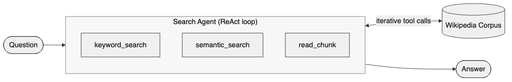
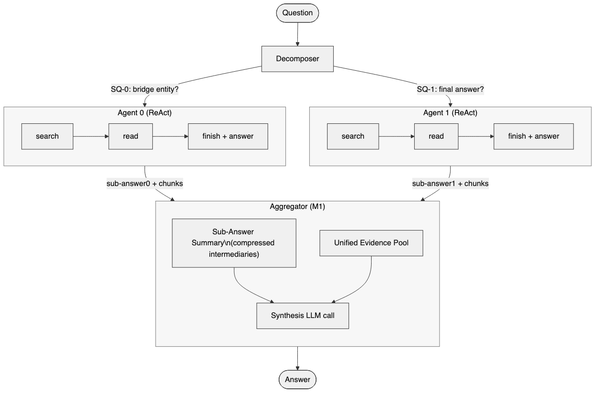
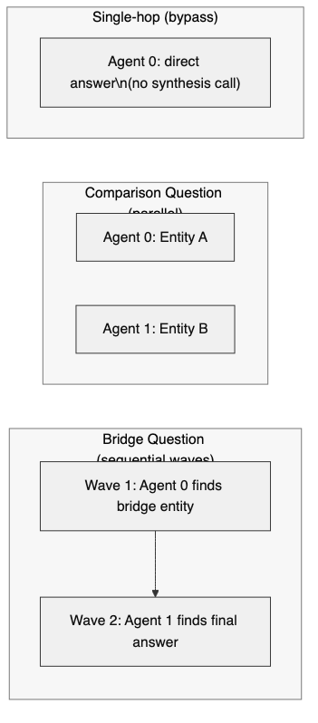
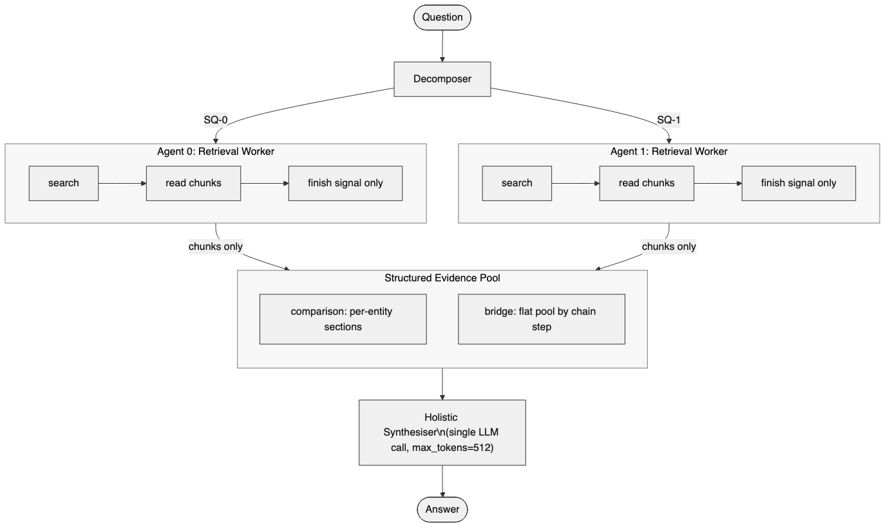
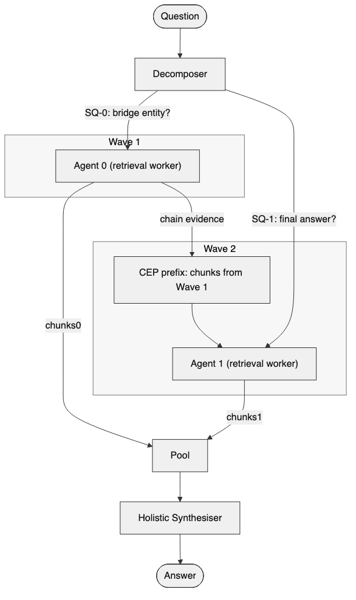
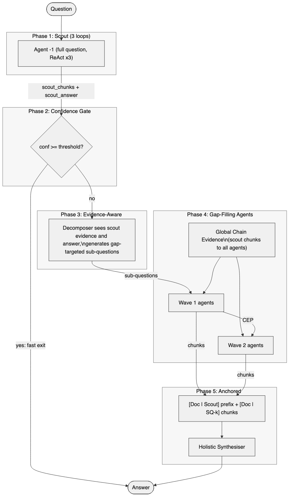

<!-- _class: title -->

# MA²RAG Multi-Agent Experiments
## Detailed Architectures and Final Results

Final systems only: **E4**, **M1v8**, **M2 DRHR**, **M3 CEP**, **M4v3 OSPREY**

Pradyut Nair · MSc Thesis · UvA MultIX · Feb 2026

---

# Shared Setup and Final Scoreboard

- Model stack: Qwen3-30B-A3B + E5-base-v2
- Judge: DeepSeek-R1-Distill-Qwen-32B
- Data: 1000 questions each on HotpotQA, 2WikiMultihop, MuSiQue
- Shared tools: `keyword_search`, `semantic_search`, `read_chunk`, `finish`

| System | HotpotQA | 2WikiMH | MuSiQue | **Mean** |
|---|---:|---:|---:|---:|
| E4 (single-agent baseline) | 66.5 | 56.9 | 37.6 | **53.7** |
| M1v8 | 54.9 | 32.3 | 30.3 | 39.2 |
| M2 DRHR | 63.4 | 34.2 | 27.2 | 41.6 |
| M3 CEP | 63.4 | 35.4 | 28.7 | 42.5 |
| **M4v3 OSPREY** | **63.8** | **44.0** | **32.2** | **46.7** |

Trend: M1 -> M2 -> M3 -> M4 improves mean from 39.2 to 46.7, but E4 remains highest at 53.7.

---

# E4 Baseline: Single-Agent A-RAG

- One ReAct agent handles full question end-to-end.
- Iterative loop: search -> read -> decide -> `finish(answer=...)`.
- No decomposition, no wave scheduling, no cross-agent coordination.
- Typical usage: ~2.66-3.05 loops, ~800-873 retrieved tokens.

| Dataset | LLM-Acc |
|---|---:|
| HotpotQA | 66.5 |
| 2WikiMH | 56.9 |
| MuSiQue | 37.6 |
| **Mean** | **53.7** |

---

# M1v8: Sub-Answer Aggregation

- Decomposer classifies `comparison` / `bridge` / `single_hop`.
- Sub-questions are solved by ReAct agents.
- Aggregator uses both sub-answers and retrieved chunks.
- In bridge chains, wrong SQ-0 can corrupt SQ-1.
- v8 specifics: comparison instruction fixed, self-verify disabled.

| Dataset | LLM-Acc |
|---|---:|
| HotpotQA | 54.9 |
| 2WikiMH | 32.3 |
| MuSiQue | 30.3 |
| **Mean** | **39.2** |

Limitation: sub-answer compression loses evidence and amplifies early-hop errors.

---

# Dispatch Strategy (M1/M2/M3)

- **Comparison:** one wave, entity-specific agents in parallel.
- **Bridge:** sequential dependency waves (`k` waits for `k-1`).
- **Single-hop:** bypass path with one direct agent.
- This same dispatch skeleton is reused in M1, M2, and M3.

Failure mode: bridge chains are most fragile because dependency mistakes propagate across waves.

---

# M2 DRHR: Decomposed Retrieval, Holistic Reasoning

- Same decomposition + dispatch as M1.
- Agents become retrieval workers; sub-answers are ignored.
- Aggregator performs one holistic synthesis on raw chunks only.
- Pooling policy: comparison per-entity sections, bridge flat chain-ordered pool.
- Synthesis cap set to `max_tokens=512`.

| Dataset | LLM-Acc |
|---|---:|
| HotpotQA | 63.4 |
| 2WikiMH | 34.2 |
| MuSiQue | 27.2 |
| **Mean** | **41.6** |

Effect: big recovery on HotpotQA vs M1 (+8.5), but bridge bottleneck remains on 2WikiMH.

---

# M3 CEP: Chain Evidence Propagation

- M2 + CEP for bridge questions.
- Wave `k` agents receive read-only chunks from waves `0..k-1`.
- CEP prompt explicitly asks agents to use prior evidence to find missing intermediate entity.
- Comparison and single-hop behavior unchanged from M2.

| Dataset | LLM-Acc |
|---|---:|
| HotpotQA | 63.4 |
| 2WikiMH | 35.4 |
| MuSiQue | 28.7 |
| **Mean** | **42.5** |

Effect: incremental gain over M2 (+0.9 mean), mainly from better bridge context continuity.

---

# M4v3 OSPREY: Scout + Evidence-Aware Pipeline

- 5 phases: Scout -> Gate -> Evidence-aware decompose -> Gap-fill agents -> Anchored synthesis.
- v3 disables fast exit (`threshold=1.1`), so all samples run full evidence path.
- Scout uses agent index `-1` (sentinel), not treated as sub-question agent.
- Scout chunks are injected globally; bridge also gets CEP wave evidence.
- Synthesis prepends `[Doc | Scout]` before sub-question chunks.

| Dataset | LLM-Acc |
|---|---:|
| HotpotQA | 63.8 |
| 2WikiMH | 44.0 |
| MuSiQue | 32.2 |
| **Mean** | **46.7** |

Best multi-agent final: strongest gains on 2WikiMH (+8.6 vs M3).

---

# Comparative Results: Gap to E4 and OSPREY Breakdown

| System | HotpotQA gap | 2WikiMH gap | MuSiQue gap | Mean gap |
|---|---:|---:|---:|---:|
| M2 DRHR | -3.1 | -22.7 | -10.4 | -12.1 |
| M3 CEP | -3.1 | -21.5 | -8.9 | -11.2 |
| **M4v3 OSPREY** | **-2.7** | **-12.9** | **-5.4** | **-7.0** |

| M4v3 by question type | bridge | comparison | single_hop | Overall |
|---|---:|---:|---:|---:|
| HotpotQA | 64.2 | 62.7 | 63.5 | 63.8 |
| 2WikiMH | 30.7 | **63.0** | 18.8 | 44.0 |
| MuSiQue | 32.3 | 12.0 | 35.2 | 32.2 |

Interpretation: OSPREY is strong on 2Wiki comparison, but bridge and implicit single-hop inference remain core deficits.

---

# Token Cost and Failure Taxonomy

| M4v3 token overhead | Scout avg | Phase-2 agents | Aggregator | Total avg |
|---|---:|---:|---:|---:|
| HotpotQA | 3,293 | 9,306 | 4,171 | 12,599 |
| 2WikiMH | 4,116 | 12,223 | 5,521 | 16,339 |
| MuSiQue | 4,549 | 16,092 | 6,224 | 20,641 |

- Scout overhead is ~25-30% of total M4v3 tokens.

| MuSiQue E4 failure taxonomy | % failures |
|---|---:|
| Retrieved but couldn't synthesize | 58.8 |
| Searched but missed | 17.8 |
| Never searched hop-2 | 12.8 |
| Decomposition failure | 10.1 |
| Corpus gap | 0.5 |

Next target: bridge-aware decomposition constraints + verifier-guided re-query to reduce synthesis and missed-hop failures.

Sources: `02-arag-multi-agent/README.md`, `02-arag-multi-agent/results/*/predictions_eval_summary.json`, `01-arag-reproduction/results/README.md`.

