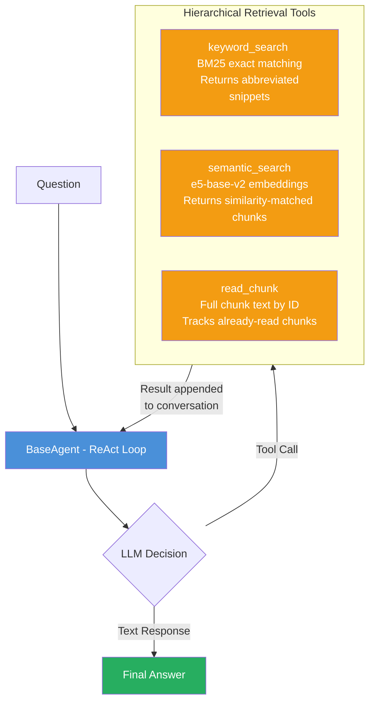
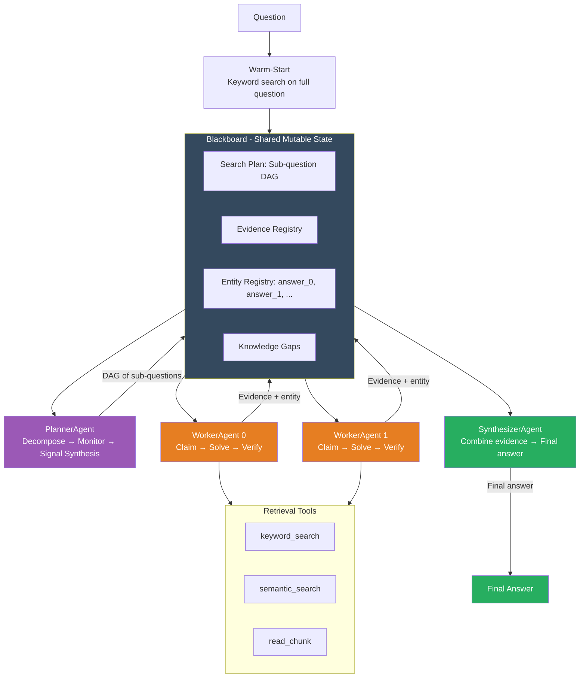
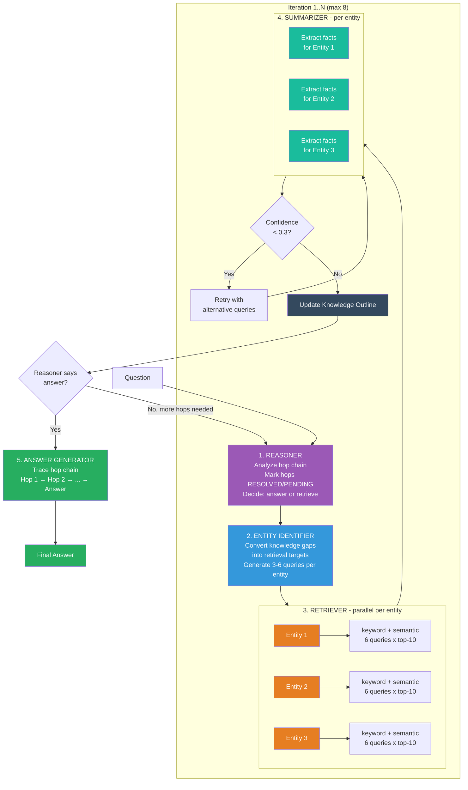
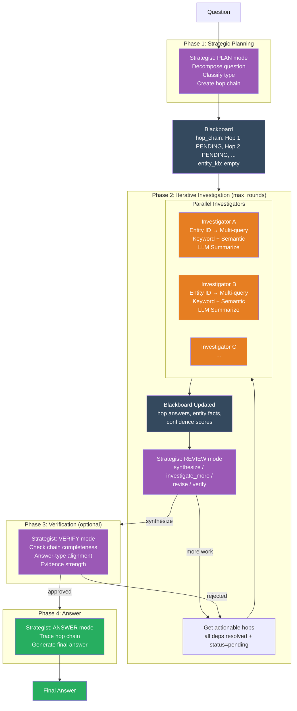
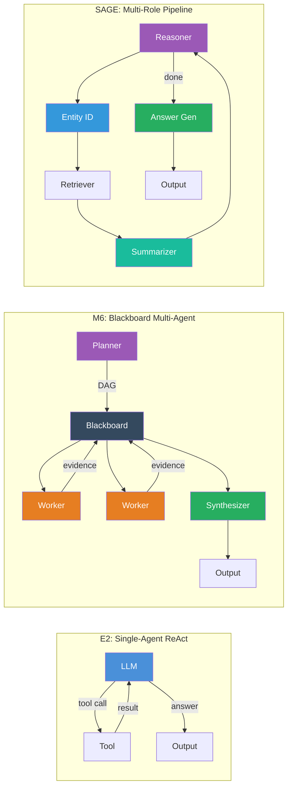

# Multi-Hop Question Answering: Architecture Comparison

This document compares QA pipeline architectures evaluated on HotpotQA, 2WikiMultiHopQA, and MuSiQue (1000 questions each).

## Results Overview

### E2 vs M6 — Fair Comparison (same judge, same prompt, concise answers)

**Problem:** E2 produces verbose answers (avg 1009 chars after stripping `<think>` tags), while M6 produces concise entity answers (avg 12 chars). Raw LLM judge scores are not comparable because the judge can find correct information embedded in E2's verbose reasoning even when E2's core answer is wrong. E2 gets **0% EM** despite 56.5% LLM judge — proving the judge evaluates reasoning quality, not answer accuracy.

**Solution:** We created a fair comparison using two approaches:
1. **E2-Concise:** Used the same Qwen3-8B model to extract core answer entities from E2's verbose predictions, making answer formats comparable.
2. **Strict LLM Judge:** Used a stricter judge prompt (DeepSeek-R1-Distill-Qwen-32B) that evaluates only the final answer claim, ignoring reasoning and hedging.

#### Primary Metrics: EM & F1 (E2-Concise vs M6 v20)

| Dataset       | E2-Concise EM | M6 v20 EM     | E2-Concise F1 | M6 v20 F1     |
| ------------- | ------------- | -------------- | ------------- | -------------- |
| HotpotQA      | 38.6%         | **42.4%**      | 48.9%         | **52.4%**      |
| 2WikiMultiHop | 35.4%         | **50.8%**      | 39.8%         | **55.8%**      |
| MuSiQue       | 13.4%         | **26.1%**      | 22.7%         | **34.5%**      |

#### Strict LLM Judge (DeepSeek-R1-Distill-Qwen-32B, same prompt for both)

| Dataset       | E2-Concise | E2-Verbose (original) | M6 v20     |
| ------------- | ---------- | --------------------- | ---------- |
| HotpotQA      | 53.8%      | 57.7%                 | **56.4%*** |
| 2WikiMultiHop | 39.4%      | 42.5%                 | **56.7%**  |
| MuSiQue       | 22.9%      | 27.7%                 | **36.0%**  |

*M6 v20 correct/total = 563/999 = 56.4% (60 failed/unanswered questions count as wrong).

> **M6 v20 beats E2 on all metrics across all datasets when the comparison is fair.** The largest gains are on 2WikiMultiHop (+15.4pp EM, +17.3pp LLM Judge) and MuSiQue (+12.7pp EM, +13.1pp LLM Judge). HotpotQA improvements are smaller but consistent (+3.8pp EM, +2.6pp LLM Judge).

### Full Results Table (all systems)

#### LLM Accuracy (original judge, not directly comparable across answer formats)

| Dataset       | E2 (Qwen3-8B) | E4 (Qwen3-30B) | M6 (Qwen3-8B) | SAGE (Qwen3-8B) | SAGE-Auto (Qwen3-8B) |
| ------------- | ------------- | -------------- | -------------- | --------------- | -------------------- |
| HotpotQA      | 59.30%        | 77.10%         | 49.63%         | 73.45%          | **73.50%**           |
| 2WikiMultiHop | 47.50%        | 70.70%         | 53.97%         | 77.11%          | **77.68%**           |
| MuSiQue       | 30.30%        | 53.30%         | 32.52%         | 51.74%          | **49.60%**           |

> **Important:** E2/E4 LLM judge scores are inflated by verbose answer format (avg 1009 chars vs 12 chars for M6/SAGE). See fair comparison above. E2/E4 judged by DeepSeek-R1-Distill-Qwen-32B; M6 judged by DeepSeek-R1-Distill-Qwen-7B; SAGE/SAGE-Auto judged by DeepSeek-R1-Distill-Qwen-7B.

### Full Metrics Comparison

#### HotpotQA (2-hop, 1000 questions)


| Metric                      | E2     | E4     | M6     | SAGE       | SAGE-Auto      |
| --------------------------- | ------ | ------ | ------ | ---------- | -------------- |
| **LLM Accuracy**            | 59.30% | 77.10% | 49.63% | **73.45%** | 73.50%         |
| **Contain (bidirectional)** | 59.40% | 67.70% | 54.15% | **77.60%** | 74.10%         |
| **Token F1**                | 3.6%*  | 3.9%*  | 52.36% | **72.54%** | 71.68%         |
| **Norm EM**                 | 0.0%*  | 0.0%*  | 41.44% | **58.20%** | 57.50%         |
| Answer Rate                 | 100.0% | 100.0% | 94.0%  | 99.8%      | 100.0%         |


#### 2WikiMultiHopQA (2-hop, 1000 questions)


| Metric                      | E2     | E4     | M6     | SAGE       | SAGE-Auto      |
| --------------------------- | ------ | ------ | ------ | ---------- | -------------- |
| **LLM Accuracy**            | 47.50% | 70.70% | 53.97% | 77.11%     | **77.68%**     |
| **Contain (bidirectional)** | 54.40% | 63.90% | 56.70% | **81.70%** | 77.10%         |
| **Token F1**                | 3.9%*  | 4.4%*  | 55.77% | **74.65%** | 73.57%         |
| **Norm EM**                 | 0.0%*  | 0.0%*  | 49.70% | **66.00%** | 64.00%         |
| Answer Rate                 | 100.0% | 100.0% | 93.2%  | 99.6%      | 99.9%          |


#### MuSiQue (3-4 hop, 1000 questions)


| Metric                      | E2     | E4         | M6     | SAGE       | SAGE-Auto  |
| --------------------------- | ------ | ---------- | ------ | ---------- | ---------- |
| **LLM Accuracy**            | 30.30% | **53.30%** | 32.52% | 51.74%     | 49.60%     |
| **Contain (bidirectional)** | 27.10% | 34.40%     | 34.60% | **53.80%** | 47.90%     |
| **Token F1**                | 2.4%*  | 2.6%*      | 34.51% | **47.29%** | 47.58%     |
| **Norm EM**                 | 0.0%*  | 0.0%*      | 25.70% | **34.90%** | 36.90%     |
| Answer Rate                 | 100.0% | 100.0%     | 94.7%  | 97.8%      | 99.8%      |


 *E2 and E4 `pred_answer` fields contain verbose reasoning (including `<think>` tags and full sentences), making EM and Token F1 unreliable for these systems. When E2 answers are extracted to concise form (E2-Concise), M6 beats E2 on all metrics — see fair comparison at top. SAGE, M6, and SAGE-Auto output clean short answers.*

### Efficiency Metrics


| Metric                          | E2      | E4      | M6          | SAGE    |
| ------------------------------- | ------- | ------- | ----------- | ------- |
| Avg tokens per question (HotpotQA) | 714     | 842     | 62,681      | —       |
| Avg tokens per question (2Wiki)    | 811     | 800     | 59,379      | —       |
| Avg tokens per question (MuSiQue)  | 751     | 873     | 75,720      | —       |
| Avg loops/ticks per question       | 2.4–2.8 | 2.7–3.0 | 6.8–7.8     | up to 8 |
| Avg latency (seconds)             | —       | —       | 103–149     | —       |


---

## 1. E2 — Baseline Single-Agent A-RAG

**Project:** `01-arag-reproduction` | **Model:** Qwen3-8B (8B dense, vLLM) | **Source:** A-RAG paper reproduction

### Architecture

E2 is a **single-agent ReAct loop** with hierarchical retrieval tools. The LLM iteratively decides which tool to call, reads results, and eventually produces an answer.




### How It Works

1. The **system prompt** instructs the agent to "work iteratively: search → read → evaluate → search → read → ... → answer"
2. Each iteration, the LLM sees the full conversation history and decides which tool to call (or stops with an answer)
3. **Three hierarchical tools** provide increasing detail:
  - `keyword_search` — fast BM25 matching, returns abbreviated snippets with chunk IDs
  - `semantic_search` — dense e5-base-v2 embedding similarity, returns top-k chunks
  - `read_chunk` — retrieves full chunk text by ID (tracks already-read chunks to avoid redundancy)
4. If the token budget (128K) or loop limit (15) is reached, a **forced final answer** prompt synthesizes from available evidence
5. `<think>` tokens from the model are stripped from outputs but preserved in context

### Multi-Hop Handling

Multi-hop is handled **implicitly** — the system prompt says "decompose the problem and tackle each sub-question step by step" but there is no explicit decomposition. The LLM must figure out the hop chain on its own through the ReAct loop.

### Key Parameters


| Parameter    | Value               |
| ------------ | ------------------- |
| Model        | Qwen3-8B            |
| Max loops    | 15                  |
| Token budget | 128,000             |
| Embedding    | intfloat/e5-base-v2 |
| Temperature  | 0.0                 |


### Strengths and Weaknesses


| Strengths                          | Weaknesses                                        |
| ---------------------------------- | ------------------------------------------------- |
| Simple, well-studied ReAct pattern | No explicit decomposition for multi-hop           |
| Low overhead per question          | Agent must track hop chain in context window      |
| Flexible tool use                  | Keyword/query formulation depends entirely on LLM |
| Proven on 2-hop questions          | Degrades sharply on 3-4 hop (MuSiQue: 30.3%)      |


---

## 2. M6 — Blackboard-Coordinated Multi-Agent System

**Project:** `02-arag-multi-agent` | **Model:** Qwen3-8B (8B dense, vLLM) | **Source:** Custom design

### Architecture

M6 replaces the single-agent ReAct loop with **four specialized agents coordinated through a shared Blackboard data structure**. The system follows the blackboard architectural pattern: agents run as independent asynchronous loops, each observing shared state, deciding whether to act, and modifying the state — without direct inter-agent communication. All blackboard mutations are protected by an `asyncio.Lock`.



### How It Works

#### Question Decomposition (Planner Agent)

The PlannerAgent receives the original question and decomposes it into a **directed acyclic graph (DAG)** of up to 5 sub-questions. The decomposition prompt classifies questions into four types:

- **Bridge** — Sequential dependency chains where later sub-questions reference earlier answers via `[answer_N]` placeholders (e.g., "What is the population of [answer_0]?")
- **Comparison** — Parallel independent sub-questions about different entities followed by a combining sub-question
- **Intersection** — Parallel constraint-gathering followed by a combining step
- **Single_hop** — Passed through as-is

Each sub-question is annotated with dependency edges, known/unknown entities, search hints, and 3–5 pre-planned keyword queries. The DAG is validated using **Kahn's algorithm** (topological sort) to reject cycles. If JSON parsing fails after 3 retries, the system falls back to a single sub-question containing the original question verbatim.

#### Sub-Question Lifecycle on the Blackboard

Sub-questions follow a strict state machine:

```
BLOCKED → READY → CLAIMED → EVIDENCE_FOUND → VERIFIED
                                            ↘ NEEDS_RETRY (attempt < max) → reclaim
                                            ↘ FAILED (max attempts) → propagate to dependents
```

- **BLOCKED → READY**: Triggered automatically when ALL prerequisite sub-questions reach VERIFIED status
- **READY → CLAIMED**: Atomic check-and-claim prevents two workers from claiming the same sub-question
- **EVIDENCE_FOUND → VERIFIED**: Posts the answer to the entity registry and triggers dependency unblocking
- **EVIDENCE_FOUND → NEEDS_RETRY**: If `attempt_count < max_attempts` (default 3), clears `claimed_by` for reclaim
- **FAILED**: When max attempts exhausted; `_propagate_failure()` recursively marks all BLOCKED dependents as FAILED

#### Worker Agents (Plan → Execute → Verify)

Two WorkerAgents run concurrently, each following an **AgentFlow-inspired** autonomous solve loop. Workers prioritize: (1) NEEDS_RETRY sub-questions (error recovery), (2) sub-questions with the most downstream dependents (critical-path heuristic), (3) lowest ID.

Upon claiming a sub-question, the worker:

1. **Resolves placeholders**: `[answer_N]` tokens are substituted with entity registry values via regex
2. **Builds context**: Resolved sub-question + cross-agent context (findings from other completed SQs, up to 800 chars each) + knowledge gaps from failed attempts + pre-planned search queries + warm-start context
3. **Enters a ReAct tool-calling loop** (up to 12 steps): The LLM decides which retrieval tool to call at each step. Workers have access to `keyword_search`, `semantic_search`, `read_chunk`, and a composite `search_and_read`
4. **Self-verifies**: Strips thinking tags, applies verbose/refusal detection (answers >60 chars with refusal patterns are cleared), and posts evidence with verification verdict

A **heartbeat coroutine** pings the blackboard every 30 seconds during long solves to prevent the coordinator's idle detector from timing out.

#### Synthesis

The SynthesizerAgent activates only when (1) all sub-questions have reached terminal states and (2) the PlannerAgent has set the `allow_synthesis` flag. It:

1. Builds structured evidence blocks per sub-question
2. Sends type-specific reasoning instructions to the LLM (comparison: extract and compare dates/numbers; yes/no: semantic equivalence; bridge: follow dependency chain to leaf answer)
3. Extracts the answer after a "FINAL ANSWER:" marker
4. Applies normalization: strips LLM artifacts, handles yes/no detection, truncates verbose answers
5. Runs **programmatic comparison correction** for patterns Qwen3-8B gets wrong (e.g., "who was born first" → extract years, compare numerically)

If synthesis fails, `salvage_answer()` implements a three-tier fallback: (1) leaf sub-question answers for bridge questions, (2) any sub-question with a usable answer, (3) any entity value from the registry.

#### Coordination and Budgets

The Coordinator runs all agents as independent async loops via `asyncio.gather()` plus a watchdog coroutine. Agents use **exponential backoff** when idle (0.05s to 2.0s). The watchdog checks four termination conditions every second:

- **Token budget**: 300,000 tokens
- **Wall-clock timeout**: 900 seconds (15 minutes)
- **Idle timeout**: 300 seconds after at least one action
- **Max actions**: 100 total

The PlannerAgent supports **one re-decomposition attempt**: if more sub-questions failed than succeeded, it re-enters decomposition with failure context while preserving already-verified entities.

### Multi-Hop Handling

Multi-hop is handled **explicitly** through the sub-question DAG:

1. **DAG decomposition**: The Planner decomposes the question and encodes dependencies between sub-questions
2. **Entity propagation**: Workers resolve `[answer_N]` placeholders using the entity registry before searching
3. **Cross-agent context**: Each worker sees findings from other completed sub-questions via the blackboard
4. **Dependency-aware scheduling**: BLOCKED sub-questions auto-unblock when prerequisites are VERIFIED

**What "explicit" means here:** The hop chain is tracked in an external data structure (the blackboard's search plan), not in the LLM's attention. Sub-question status transitions are enforced programmatically. If a dependency fails, all downstream sub-questions are automatically marked as FAILED. This structural enforcement means the system cannot accidentally skip a hop or answer with an intermediate entity.

**Comparison with E2 — "What county is the birthplace of the director of Jaws in?":**

| Step | E2 (Implicit) | M6 (Explicit) |
| ---- | ------------- | ------------- |
| Recognize hops | LLM internally realizes 3 hops are needed | Planner outputs DAG: SQ0 → SQ1 → SQ2 with dependency edges |
| After Hop 1 | "Steven Spielberg" is in conversation history; LLM must remember it | Entity registry: `answer_0 = "Steven Spielberg"`. SQ0 → VERIFIED. SQ1 auto-unblocks |
| Hop 2 query | LLM hopefully searches "Steven Spielberg birthplace" — but might search "director of Jaws birthplace" | Worker resolves `[answer_0]` → "Steven Spielberg" in SQ1's queries before searching |
| Hop 3 query | LLM must remember "Cincinnati" and search for its county | Same structured propagation using `answer_1 = "Cincinnati"` from registry |

### Key Parameters


| Parameter              | Value               |
| ---------------------- | ------------------- |
| Model                  | Qwen3-8B            |
| Num workers            | 2                   |
| Worker max steps       | 12                  |
| Token budget           | 300,000             |
| Wall-clock timeout     | 900s                |
| Idle timeout           | 300s                |
| Max actions            | 100                 |
| Max re-decompositions  | 1                   |
| Embedding              | intfloat/e5-base-v2 |
| Temperature            | 0.0                 |
| Thinking mode          | Disabled            |


### Strengths and Weaknesses


| Strengths                                        | Weaknesses                                          |
| ------------------------------------------------ | --------------------------------------------------- |
| Explicit DAG decomposition for multi-hop         | ReAct workers still unreliable with 8B LLM          |
| Dependency-aware sub-question scheduling         | Workers generate one query at a time (low recall)   |
| Entity registry enables hop propagation          | High token overhead (59K–76K per question)           |
| Parallel workers for independent sub-questions   | Self-verification is heuristic, not evidence-based  |
| Programmatic comparison correction               | No systematic query augmentation                    |
| Failure propagation prevents impossible sub-questions | Single re-decomposition may not recover complex failures |

### Why M6 Underperforms

M6 shows mixed results compared to E2: it scores lower on HotpotQA (49.6% vs 59.3%) but higher on 2Wiki (54.0% vs 47.5%) and MuSiQue (32.5% vs 30.3%). The explicit decomposition helps on datasets requiring precise entity linking (2Wiki, MuSiQue) but hurts on HotpotQA where E2's simpler approach suffices. Key limitations:

- **ReAct workers are unreliable at 8B scale**: Workers have 12 steps of LLM-guided tool calling, but Qwen3-8B frequently produces malformed tool calls, calls irrelevant tools, or exits the loop prematurely. The multi-agent overhead can amplify rather than mitigate this failure mode.
- **Single-query retrieval**: Workers generate one search query per ReAct step, typically executing 1–2 total queries per sub-question. This narrow retrieval misses relevant evidence that alternative phrasings would find.
- **Token overhead**: M6 uses 59K–76K tokens per question (vs E2's ~750 tokens), indicating that the additional context from cross-agent communication and sub-question management is expensive relative to its gains.
- **Answer rate**: M6 only answers 93–95% of questions (vs E2's 100%), meaning some questions are lost to budget/timeout termination.

---

## 3. SAGE — Structured Agent Graph for Evidence

**Project:** `03-sage-multi-agent` | **Model:** Qwen3-8B (8B dense, vLLM) | **Source:** Custom design

### Architecture

SAGE is fundamentally different. It replaces the single-agent ReAct loop with an **iterative multi-role pipeline** of four specialized LLM roles. There is no agent loop — instead, each iteration follows a structured 4-step process with a shared **Knowledge Outline** that accumulates facts across iterations.




### How It Works

**Step 1 — Reasoner** (`sage_v3_reasoner.txt`):

- Decomposes the question into its hop chain
- Marks each hop as `[RESOLVED]` or `[PENDING]` based on the Knowledge Outline
- Decides `mode=answer` (all hops resolved) or `mode=retrieve` (hops still pending)
- Key rule: force `retrieve` if ANY hop is still `[PENDING]`

**Step 2 — Entity Identifier** (`sage_v3_entity_identifier.txt`):

- Converts knowledge gaps into concrete retrieval targets: `{entity, goal, queries[]}`
- Critical innovation: queries **must incorporate answers from previous hops**
  - e.g., If Hop 1 found "director of Jaws = Steven Spielberg", Hop 2 queries are "Steven Spielberg birthplace" — not "director of Jaws birthplace"
- Generates 3 diverse queries per entity (specific, broad/synonym, contextual)

**Step 3 — Retriever** (programmatic, no LLM):

- For each entity, runs BOTH keyword and semantic search with ALL queries
- Automatic query augmentation: goal keywords like "birthplace" trigger variant queries ("born", "early life biography")
- Aggressive retrieval: up to 6 queries x 2 methods x top-10 = 120 search operations per entity

**Step 4 — Summarizer** (`sage_v3_summarizer.txt`):

- Extracts facts from retrieved chunks for a specific entity + goal
- Lenient extraction: "if a fact might be relevant, include it"
- Returns structured JSON: `{facts: [], confidence: float, supporting_chunk_ids: []}`
- Fallback: regex-based sentence extraction when LLM summary is empty

**Low-confidence retry**: Entities with confidence < 0.3 and no useful facts are re-queried with alternative formulations ("X wikipedia", "who is X", "what is X")

**Step 5 — Answer Generator** (`sage_v3_answer.txt`):

- Traces the complete hop chain: "Hop 1: found X → Hop 2: found Y about X → FINAL ANSWER: Y"
- Preserves exact qualifiers ("mid-June" stays "mid-June", not "June")
- Answer is the result of the LAST hop, not an intermediate hop
- Falls back to best Knowledge Outline fact if the generator produces a refusal

### The Knowledge Outline

The central data structure that makes SAGE work:

```
Knowledge Outline = {
    "Steven Spielberg": {
        "facts": ["Born in Cincinnati, Ohio", "Directed Jaws (1975)"],
        "confidence": 0.85,
        "supporting_chunk_ids": ["chunk_42", "chunk_108"]
    },
    "Cincinnati": {
        "facts": ["Located in Hamilton County, Ohio"],
        "confidence": 0.90,
        "supporting_chunk_ids": ["chunk_215"]
    }
}
```

This structure enables:

- **Cross-iteration memory**: Facts accumulate; later iterations build on earlier discoveries
- **Confidence-based retry**: Low-confidence entities get re-queried
- **Hop propagation**: Entities from Hop N become query targets for Hop N+1
- **Answer fallback**: If the answer generator fails, the best fact is used

### Multi-Hop Handling

This is where SAGE fundamentally differs. Multi-hop is handled **explicitly** through:

1. **Hop chain tracking**: The Reasoner decomposes the question and tracks which hops are resolved
2. **Entity propagation**: The Entity Identifier uses resolved entities from previous hops in its queries
3. **Knowledge accumulation**: The Knowledge Outline grows across iterations
4. **Automatic query augmentation**: Attribute-specific query variants ensure BM25 can match documents even when question phrasing differs from document text (e.g., "birthplace" → "born")
5. **Iterative refinement**: Up to 8 iterations with 3-consecutive-empty early stopping

### Key Parameters


| Parameter                  | Value    |
| -------------------------- | -------- |
| Model                      | Qwen3-8B |
| Max iterations             | 8        |
| Max entities per iteration | 3        |
| Max queries per entity     | 6        |
| Retrieval top-k            | 10       |
| Max doc chars (summarizer) | 5,000    |
| Temperature                | 0.0      |


---

## 4. SAGE-Autonomous — Blackboard-Based Collaborative Multi-Agent Search

**Project:** `04-sage-autonomous` | **Model:** Qwen3-8B (8B dense, vLLM) | **Source:** Custom design

### Architecture

SAGE-Autonomous replaces SAGE's fixed 4-step pipeline with **genuinely autonomous agents coordinated via a shared Blackboard**. Three component types collaborate dynamically:

1. **Strategist** — Plans, reviews, verifies, generates answers (the "brain")
2. **Investigators** — Programmatic structured retrieval agents, one per hop (the "hands")
3. **Blackboard** — Shared structured knowledge state with hop chain + entity KB (the "memory")



### How It Works

#### The Blackboard

The central shared data structure that enables inter-agent communication:

```python
@dataclass
class Hop:
    id: int
    question: str              # May contain [hop_N] placeholders
    resolved_question: str     # With placeholders filled from resolved hops
    status: str                # "pending" | "investigating" | "resolved" | "stuck"
    depends_on: list[int]      # Which hops must resolve first
    answer: str | None
    evidence: list[dict]       # [{text, source_agent, chunk_ids}]
    confidence: float
    attempt_count: int

@dataclass
class EntityInfo:
    name: str
    facts: list[str]
    confidence: float
    source_chunks: list[str]

@dataclass
class Blackboard:
    question: str
    question_type: str         # "comparison" | "bridge" | "single_hop"
    expected_answer_type: str
    hop_chain: list[Hop]
    entity_kb: dict[str, EntityInfo]
    strategy_notes: str
```

Key methods: `get_actionable_hops()` returns pending hops whose dependencies are all resolved; `resolve_placeholders()` substitutes `[hop_N]` tokens with actual resolved answers; `get_context_for_investigator()` formats a summary of all resolved findings for cross-agent context.

#### The Strategist

The Strategist makes focused single-call LLM decisions at key points — it is NOT a ReAct agent. Four modes:

**PLAN** — Analyzes the question, classifies type (comparison/bridge/single_hop), determines expected answer type, and creates a hop chain with dependencies. For bridge questions, hops use `[hop_N]` placeholders (e.g., "What county is [hop_0] in?" where hop_0 resolves "birthplace of X").

**REVIEW** — After investigators report, assesses Blackboard state and decides: `synthesize` (all done), `investigate_more` (mark new hops), `revise` (change hop questions, add hops), or `verify` (trigger verification).

**VERIFY** — Checks evidence chain before final answer: chain completeness (every hop has evidence), chain consistency (hop N answer used correctly in hop N+1), answer-type alignment, confidence thresholds.

**ANSWER** — Traces the hop chain and generates the final answer. Reuses the proven `sage_v3_answer.txt` prompt. Includes a fallback for comparison questions that extracts candidate entities from the question when the LLM returns empty.

**Total Strategist LLM calls**: 3–5 per question (plan + 1–3 reviews + answer, optional verify).

#### The Investigator

Each Investigator handles **one hop** using SAGE v3r2's proven programmatic retrieval pattern (NOT a ReAct loop). This was a key design decision — early experiments showed that small LLMs (8B) are unreliable at ReAct-style tool calling, so the investigator uses a structured 3-step process:

1. **Entity Identification** (LLM call) — Extract retrieval targets from the hop question: `{entity, goal, queries[]}`. The LLM generates 3–6 diverse queries per entity.

2. **Retrieval** (programmatic, no LLM) — For each entity, runs BOTH keyword and semantic search with ALL queries. Automatic query augmentation expands attribute queries (e.g., "birthplace" → "born", "early life biography"). Up to 6 queries × 2 methods × top-k per entity.

3. **Summarization** (LLM call) — Extracts facts from retrieved chunks for the specific entity + goal. Returns structured JSON with facts, confidence, and supporting chunk IDs.

**Blackboard integration**: Each investigator reads from the Blackboard at start (other agents' findings for cross-pollination) and writes back on completion (entity facts, hop answer, evidence, confidence).

**Entity-level retry** (configurable): When confidence < 0.6, retries with alternative queries ("X wikipedia", "X biography", goal-specific reformulations). Enabled only for HotpotQA where it improves accuracy; disabled for 2Wiki/MuSiQue where it can hurt.

**Total per investigator**: 2 LLM calls (entity ID + summarize), optionally 2 more on retry.

#### The Pipeline

```python
class AutonomousPipeline:
    async def run(self, question: str) -> PipelineResult:
        blackboard = Blackboard(question)

        # Phase 1: Plan
        await self.strategist.plan(question, blackboard)

        # Phase 2: Iterative investigation
        for round in range(self.max_rounds):
            actionable = blackboard.get_actionable_hops()
            if not actionable:
                break

            # Spawn investigators in parallel for independent hops
            await asyncio.gather(*[
                self._run_investigator(hop, blackboard)
                for hop in actionable[:self.max_concurrent]
            ])

            # Strategist reviews
            decision = await self.strategist.review(blackboard)
            if decision.mode == "synthesize":
                break
            elif decision.mode == "revise":
                blackboard.apply_revisions(decision.revisions)
            elif decision.mode == "verify":
                verdict = await self.strategist.verify(blackboard)
                if verdict.approved:
                    break
                for hop_id in verdict.weak_hops:
                    blackboard.hop_chain[hop_id].status = "pending"

        # Phase 3: Answer
        return await self.strategist.generate_answer(blackboard)
```

**Adaptive effort allocation**:
- Single-hop: Plan + 1 investigator + Answer = **~5 LLM calls**
- 2-hop bridge: Plan + 2 investigators (sequential) + Review + Answer = **~9 calls**
- 2-hop comparison: Plan + 2 investigators (parallel) + Review + Answer = **~9 calls, faster wall-clock**
- 3–4 hop (MuSiQue): Plan + 3–4 investigators + 2–3 reviews + Verify + Answer = **~16–28 calls**

### What Changed from SAGE v3r2

| Aspect | SAGE v3r2 | SAGE-Autonomous |
|--------|-----------|-----------------|
| Control flow | Fixed Reasoner→EntityID→Retrieve→Summarize cycle | Dynamic: Strategist decides what to do next |
| Planning | Static decomposition (Reasoner analyzes once per iteration) | Dynamic hop chain with revisions (Strategist plans once, reviews and revises) |
| Knowledge state | Knowledge Outline (append-only dict) | Blackboard with typed Hops, dependencies, and confidence |
| Parallelism | Entities parallel within one iteration, iterations sequential | Independent hops investigated in parallel across iterations |
| Self-correction | Low-confidence entity retry | Strategist verification loop + entity retry |
| Inter-agent comms | None (single pipeline, roles share context) | Via Blackboard (investigators read other agents' findings) |
| Answer fallback | Extract from Knowledge Outline | Comparison fallback extracts candidates from question |
| Configuration | One config for all datasets | Per-dataset configs (top_k, retry settings) |

### Key Parameters

| Parameter | HotpotQA | 2Wiki | MuSiQue |
|-----------|----------|-------|---------|
| Model | Qwen3-8B | Qwen3-8B | Qwen3-8B |
| Max rounds | 4 | 4 | 6 |
| Max concurrent investigators | 3 | 3 | 3 |
| Retrieval top-k | 10 | 15 | 15 |
| Entity retry (low confidence) | Yes | No | No |
| Verification enabled | Yes | Yes | Yes |
| Min confidence threshold | 0.3 | 0.3 | 0.3 |
| Temperature | 0.0 | 0.0 | 0.0 |

### Strengths and Weaknesses

| Strengths | Weaknesses |
|-----------|------------|
| Dynamic planning adapts to evidence discovered | More LLM calls than SAGE for complex questions |
| Verification catches wrong-hop and wrong-type answers | Strategist JSON parsing can fail with small LLMs |
| Cross-agent context improves downstream investigators | Entity retry helps some datasets, hurts others |
| Parallel investigation of independent hops | Still relies on same retrieval infrastructure |
| Per-dataset configuration for optimal tradeoffs | Higher contain_bi variance than SAGE v3r2 |
| Comparison fallback prevents empty answers | Verification sometimes over-corrects correct answers |

### Results: SAGE-Autonomous vs SAGE v3r2

All results on 1000 questions per dataset, LLM judge = DeepSeek-R1-Distill-Qwen-7B.

| Dataset | Metric | SAGE v3r2 | SAGE-Auto | Delta |
|---------|--------|:---------:|:---------:|:-----:|
| HotpotQA | **LLM Accuracy** | 73.45% | **73.50%** | **+0.05pp** |
| HotpotQA | Contain (bi) | **77.60%** | 74.10% | -3.50pp |
| HotpotQA | Token F1 | **72.54%** | 71.68% | -0.86pp |
| HotpotQA | Norm EM | **58.20%** | 57.50% | -0.70pp |
| 2WikiMultiHop | **LLM Accuracy** | 77.11% | **77.68%** | **+0.57pp** |
| 2WikiMultiHop | Contain (bi) | **81.70%** | 77.10% | -4.60pp |
| 2WikiMultiHop | Token F1 | **74.65%** | 73.57% | -1.08pp |
| 2WikiMultiHop | Norm EM | **66.00%** | 64.00% | -2.00pp |
| MuSiQue | **LLM Accuracy** | **51.74%** | 49.60% | -2.14pp |
| MuSiQue | Contain (bi) | **53.80%** | 47.90% | -5.90pp |
| MuSiQue | Token F1 | 47.29% | **47.58%** | +0.29pp |
| MuSiQue | Norm EM | 34.90% | **36.90%** | +2.00pp |

**Key observation**: SAGE-Autonomous shows marginal LLM accuracy improvement on HotpotQA and 2Wiki (+0.05pp and +0.57pp) but slightly lower on MuSiQue (-2.14pp) compared to SAGE v3r2. The contain_bi scores are consistently lower, suggesting the autonomous pipeline produces more contextually appropriate answers that are phrased differently from the gold answer string. The dynamic planning and verification add value on 2-hop questions but do not yet translate to clear gains on the harder 3-4 hop MuSiQue benchmark.

**Improvement sources**:
- Self-verification catches wrong-hop answers (e.g., answering with an intermediate entity instead of the final hop)
- Dynamic planning handles bridge questions with implicit dependencies better
- Cross-agent context via Blackboard helps downstream investigators use earlier findings
- Comparison fallback prevents empty answers on "X or Y?" questions
- Entity-level retry (HotpotQA only) recovers low-confidence first attempts


---

## Architectural Comparison

### Pipeline Structure




### Feature Comparison


| Feature                     | E2                             | M6                                       | SAGE                                                  | SAGE-Autonomous                                           |
| --------------------------- | ------------------------------ | ---------------------------------------- | ----------------------------------------------------- | --------------------------------------------------------- |
| **Architecture**            | Single agent, ReAct loop       | Blackboard + 4 async agents              | Iterative multi-role pipeline                         | Blackboard-based multi-agent collaborative search         |
| **Decomposition**           | Implicit                       | Explicit (DAG with dependencies)         | Explicit (Reasoner traces hops)                       | Explicit (Strategist plans dynamic hop chain)             |
| **Tool interface**          | Raw (keywords, query, IDs)     | Raw (workers use ReAct tool calls)       | Programmatic (SearchAndRead)                          | Programmatic (Investigator per hop)                       |
| **LLM calls/question**      | 2–15                           | ~10–30 (planner + workers + synthesizer) | 4–32+ (4 roles x iterations)                          | 5–28 (strategist + investigators + answer)                |
| **Search strategy**         | Agent-chosen, ad hoc           | Agent-chosen via ReAct workers           | Systematic: all entities x all queries x both methods | Systematic per hop, with cross-agent context              |
| **Knowledge state**         | Read-chunk ID tracker          | Blackboard (DAG + evidence + entities)   | Knowledge Outline (entity → facts + confidence)       | Blackboard (hop chain + entity KB, read/write by all)     |
| **Hop propagation**         | Agent must remember in context | Entity registry with `[answer_N]` placeholders | Explicit: Hop N entities used in Hop N+1 queries | Explicit: resolved hops feed dependent hops via Blackboard|
| **Query augmentation**      | None (LLM-dependent)           | None (LLM-dependent via ReAct)           | Automatic attribute-specific variants                 | Automatic + configurable entity-level retry               |
| **Low-confidence handling** | None                           | Per-SQ retry (max 3 attempts)            | Retry with alternative queries                        | Configurable entity retry + Strategist verification loop  |
| **Planning**                | None                           | Explicit DAG (1 re-decomposition)        | Static (Reasoner decomposes once)                     | Dynamic (Strategist revises plan based on findings)       |
| **Self-correction**         | None                           | Worker self-verify + re-decomposition    | None                                                  | Strategist verify mode checks evidence chain              |
| **Inter-agent comms**       | N/A                            | Via Blackboard (cross-agent context)     | N/A (single pipeline)                                 | Via Blackboard (investigators see each other's findings)  |
| **Model**                   | Qwen3-8B (8B dense)            | Qwen3-8B (8B dense)                      | Qwen3-8B (8B dense)                                   | Qwen3-8B (8B dense)                                      |
| **Embedding**               | e5-base-v2                     | e5-base-v2                               | e5-base-v2                                            | e5-base-v2                                                |


### Why Structured Pipelines Win

The core insight is that **multi-hop QA requires structured reasoning, not general-purpose tool use**:

1. **Explicit decomposition beats implicit**: E2 relies on the LLM to internally track which hops are resolved. M6 introduces explicit DAG decomposition, and SAGE/SAGE-Autonomous go further with typed hop chains and dynamic revision.
2. **Programmatic retrieval beats ReAct tool calling**: M6's ReAct workers (12-step LLM-guided tool calling) underperform E2's simpler ReAct loop, suggesting that multi-agent overhead hurts when workers still rely on unreliable LLM tool-calling at 8B scale. SAGE's programmatic retrieval (2 LLM calls per entity: entity ID + summarization) eliminates this failure mode entirely.
3. **Systematic retrieval beats ad hoc**: E2 and M6 search with whatever query the agent formulates (typically 1–2 queries per sub-question). SAGE/SAGE-Auto fire 6 query variants x 2 methods x top-k per entity, plus automatic attribute-based augmentation. This brute-force approach compensates for BM25's lexical mismatch problem.
4. **Entity propagation is critical**: On MuSiQue (3-4 hops), intermediate entities must flow into subsequent queries. Both SAGE variants and M6 force resolved entities into downstream queries. E2 must hope the LLM remembers to do this.
5. **Knowledge accumulation provides robustness**: SAGE's Knowledge Outline and SAGE-Auto's Blackboard persist structured state across iterations. If the first retrieval attempt fails, later iterations can retry with targeted feedback. E2's conversation context grows linearly and eventually exceeds the budget.
6. **Dynamic planning adds another layer**: SAGE-Autonomous's Strategist can revise the hop chain based on what investigators actually find, rather than committing to a static plan. This is especially valuable when initial decomposition misidentifies the question structure.
7. **Self-verification catches errors**: SAGE-Autonomous's verify mode checks that the answer comes from the correct (final) hop and matches the expected answer type, catching a class of errors that static pipelines miss.

### Performance Scaling by Hop Complexity


| Dataset       | Hops | E2 (8B) | E4 (30B) | M6 (8B)  | SAGE (8B) | SAGE-Auto (8B) | Best         |
| ------------- | ---- | ------- | -------- | -------- | --------- | -------------- | ------------ |
| HotpotQA      | 2    | 59.3%   | **77.1%**| 49.6%    | 73.5%     | 73.5%          | E4           |
| 2WikiMultiHop | 2    | 47.5%   | 70.7%    | 54.0%    | 77.1%     | **77.7%**      | SAGE-Auto    |
| MuSiQue       | 3–4  | 30.3%   | **53.3%**| 32.5%    | 51.7%     | 49.6%          | E4           |


SAGE with Qwen3-8B is the strongest system on 2WikiMultiHop, surpassing even E4's Qwen3-30B by 7.0pp. On MuSiQue, SAGE nearly matches the 4x larger model (-1.6pp). The structured pipeline's advantage is most pronounced on compositional questions requiring precise entity linking (2Wiki) where systematic retrieval and entity propagation compensate for model size. M6's blackboard architecture improves over E2 on 2Wiki (+6.5pp) and MuSiQue (+2.2pp) through explicit decomposition, but still falls far short of SAGE/SAGE-Auto, demonstrating that **how** agents retrieve (programmatic vs ReAct) matters more than **whether** questions are decomposed.

---

## Evaluation

All results use a **DeepSeek-R1-Distill** LLM judge (not the same model that generated answers). E2/E4 use the 32B variant; M6, SAGE, and SAGE-Auto use the 7B variant. The judge evaluates whether predictions are semantically equivalent to gold answers, with equivalence rules for name variants, abbreviations, and partial matches.

### Metrics


| Metric                      | Description                                                             | Reliability                                                           |
| --------------------------- | ----------------------------------------------------------------------- | --------------------------------------------------------------------- |
| **LLM Accuracy**            | DeepSeek judge rates prediction as correct/incorrect                    | Primary metric — handles paraphrases, name variants, partial matches  |
| **Contain (bidirectional)** | Normalized gold is substring of pred OR pred is substring of gold       | High for short answers; false negatives on paraphrases                |
| **Token F1**                | Token-level F1 between normalized prediction and gold answer            | Requires clean `pred_answer` field (unreliable for E2/E4)             |
| **Norm EM**                 | Exact match after normalization (lowercase, strip articles/punctuation) | Strictest metric; requires clean `pred_answer` (unreliable for E2/E4) |
| **Contain (eval.py)**       | Gold substring in prediction (unidirectional, from `eval.py`)           | Slightly different from bidirectional contain                         |


### Note on Metric Reliability

E2 and E4 store the **full LLM response** (including `<think>` reasoning blocks and verbose sentences) in their `pred_answer` field. While the offline eval script strips `<think>` tags, the remaining verbose text means:

- **EM = 0%** for all E2/E4 runs (answers are never exact matches)
- **Token F1 = 2-4%** (prediction contains far more tokens than the gold answer)
- **Contain and LLM Accuracy** remain reliable since they tolerate extra text

SAGE, M6, and SAGE-Auto output **clean short answers**, making all metrics reliable for these systems. For fair cross-system comparison, use **LLM Accuracy** (primary) and **Contain (bidirectional)** (secondary).
