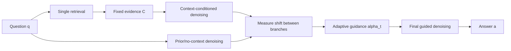
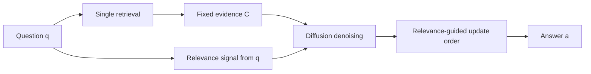
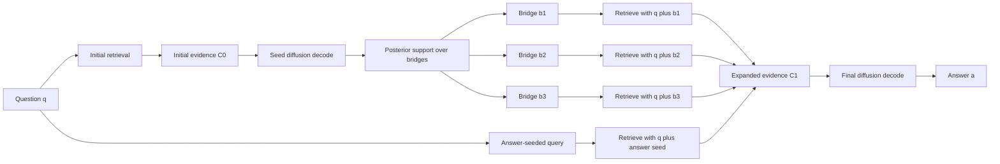
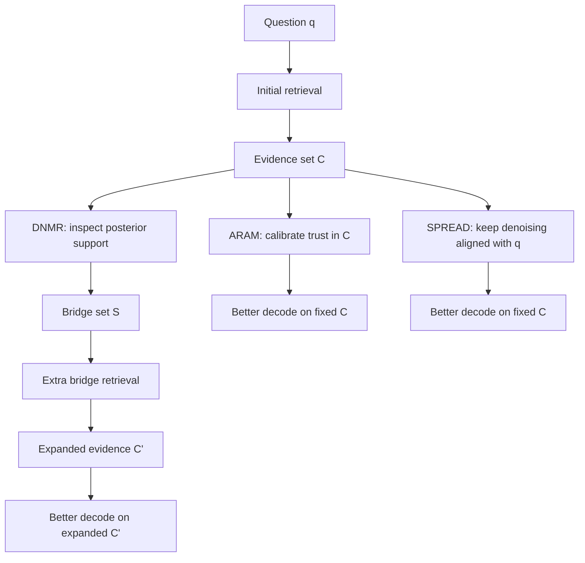

# ARAM vs SPREAD vs DNMR

This note explains `ARAM` and `SPREAD` from `README.md`, then positions our `DNMR` method against them in a way that is both intuitive and mathematical.

The shortest version is:

- `ARAM` asks: how much should the model trust retrieved evidence while denoising?
- `SPREAD` asks: how can denoising stay aligned with the question semantics?
- `DNMR` asks: what bridge hypotheses are latent in the diffusion posterior, and how can we retrieve with them before answering?

That last question is the one that matters most for multi-hop QA.

## Executive Take

There are two kinds of improvements in diffusion-RAG:

1. **Decode better on the same evidence**
2. **Retrieve better evidence before decoding**

`ARAM` and `SPREAD` are mostly in category 1.

`DNMR` is in category 2.

For multi-hop QA, category 2 is usually more important because the hardest problem is often not "reading the evidence better", but "finding the missing bridge evidence at all".

## The Core Multi-Hop Problem

A 2-hop question typically has hidden structure like:

```text
question q
   -> bridge entity or bridge fact b
   -> next-hop evidence
   -> answer a
```

Example pattern:

```text
Who directed the film starring the actor who played X?
```

You usually cannot answer this well from one generic retrieval query. You need the bridge:

```text
X -> actor -> film -> director
```

If retrieval misses the bridge, better decoding cannot fully save you.

## A Unifying Lens

Let:

- `q` be the question
- `C` be the retrieved context
- `a` be the final answer
- `b` be a latent bridge hypothesis

Then the methods differ mainly in **what object they optimize**:

| Method | Main object | What it improves |
|--------|-------------|------------------|
| `ARAM` | guidance strength during denoising | trust calibration on fixed evidence |
| `SPREAD` | relevance-aware denoising order/weighting | semantic alignment on fixed evidence |
| `DNMR` | posterior over bridge hypotheses | retrieval coverage before final decode |

This is the cleanest conceptual split:

- `ARAM` and `SPREAD` act mostly on $p(a \mid q, C)$
- `DNMR` acts on how we construct `C` in the first place

## 1. ARAM

### Intuition

`ARAM` is about **adaptive trust**.

Retrieved passages are not always reliable. Some are highly useful, some are noisy, and some conflict with the model's prior knowledge. ARAM compares a context-conditioned denoising path against a prior or no-context path, then uses that contrast to set a guidance scale.

So ARAM says:

> "If the retrieved evidence is genuinely helping, lean into it. If it looks noisy or contradictory, back off."

### Visual



### Simple mathematical view

At denoising step `t`, ARAM can be thought of as comparing two score or logit signals:

- one from the model with context
- one from the model without context

In schematic form:

$$
\ell_t^{\text{guided}}
\;=\;
\ell_t^{\text{ctx}}
\;+\;
\alpha_t \big(\ell_t^{\text{ctx}} - \ell_t^{\text{prior}}\big),
$$

where $\ell_t^{\text{ctx}}$ is the denoising signal using retrieved context, $\ell_t^{\text{prior}}$ is the no-context or prior branch, and $\alpha_t$ is an adaptive trust coefficient.

The exact ARAM paper has its own formulation, but this captures the mechanism:

- if context adds useful signal, increase $\alpha_t$
- if context looks unreliable, reduce $\alpha_t$

### What ARAM is good at

ARAM helps when:

- the correct evidence is already in `C`
- the model needs calibration about how strongly to use it
- noisy retrieval would otherwise corrupt denoising

### Why ARAM is limited for multi-hop QA

The main limitation is structural:

$$
C \text{ is fixed.}
$$

If the bridge evidence is missing from the initial retrieval set, ARAM has no mechanism for discovering it. It improves **decoding on fixed evidence**, not **retrieval expansion**.

So ARAM is strongest when the bottleneck is evidence trust, not evidence discovery.

## 2. SPREAD

### Intuition

`SPREAD` is about **semantic alignment during denoising**.

Diffusion models can drift: as denoising proceeds, the partially formed answer may become less aligned with the original question. SPREAD tries to keep generation anchored to query relevance throughout the denoising process.

So SPREAD says:

> "Stay focused on what the question is really asking at every denoising step."

### Visual



### Simple mathematical view

SPREAD can be understood as adding a query-relevance preference to denoising. In abstract form, at each step it prefers token updates with higher question relevance:

$$
\text{score}_t(x)
\;=\;
\text{denoise}_t(x \mid q, C)
\;+\;
\lambda \,\text{Rel}(x, q),
$$

or equivalently it reorders denoising decisions so that semantically relevant tokens are resolved earlier or with higher priority.

The exact implementation details differ, but the important idea is:

- `Rel(x, q)` measures how aligned a candidate update is with the question
- the denoising trajectory is nudged toward question-faithful generations

### What SPREAD is good at

SPREAD helps when:

- the model drifts semantically
- the answer includes irrelevant copied context
- the question is precise but the denoising path is sloppy

### Why SPREAD is limited for multi-hop QA

Again, the limitation is:

$$
C \text{ is fixed.}
$$

SPREAD can help the model answer more faithfully from the evidence it has, but it does not solve the upstream problem that one query embedding may blur together multiple hops.

In multi-hop QA, the retriever often needs:

- one query for the seed question
- another query for the bridge entity
- sometimes several bridge variants

SPREAD does not create those extra retrieval paths by itself.

## 3. DNMR

### Intuition

`DNMR` is about **retrieval through posterior support**.

Instead of asking the model to commit to one answer path too early, we look inside the diffusion posterior and extract several plausible bridge candidates. Those candidates are then turned into targeted retrieval queries.

So DNMR says:

> "Before collapsing to one answer, use the diffusion posterior to expose multiple possible bridges and retrieve for all of them."

### Visual



### Why this is diffusion-native

An autoregressive system normally exposes one committed partial sequence at a time. To get multiple bridge hypotheses, it usually needs repeated sampling, beam search, or multiple generations.

A diffusion model naturally gives access to a richer proposal distribution over possible bridge continuations during denoising.

DNMR turns that distribution into retrieval.

That is the key novelty:

```text
diffusion posterior -> bridge set -> retrieval expansion -> better evidence
```

## 4. The Math of DNMR

### Step 1: define a bridge posterior

Let $\mathcal B_r$ be the set of normalized bridge strings at round $r$.

For each proposal position `j`, the diffusion model induces a position-conditioned bridge posterior:

$$
\pi_r(b \mid j)
=
\mathbb P_\theta(B_{r,j}^\star = b \mid q, C_r, j).
$$

If we mix over several informative positions with selector $\sigma_r(j \mid q, C_r)$, we get the mixed bridge posterior:

$$
\tilde \pi_r(b)
=
\sum_{j \in J_r} \sigma_r(j \mid q, C_r)\,\pi_r(b \mid j).
$$

Intuition:

$\pi_r(b \mid j)$ asks: if I branch at position $j$, how likely is bridge $b$?

$\tilde\pi_r(b)$ asks: after aggregating informative proposal positions, how much posterior support does bridge $b$ have overall?

### Step 2: choose the top bridge set

With bridge budget `k`, DNMR chooses:

$$
S_r^{(k)} := \operatorname{TopK}(\tilde \pi_r, k).
$$

Define retained bridge mass of any candidate set `S` by:

$$
\Pi_r(S) := \sum_{b \in S}\tilde\pi_r(b).
$$

Then the core result is:

$$
\Pi_r(S_r^{(k)})
=
\max_{|S|=k} \Pi_r(S).
$$

Meaning:

> Among all size-`k` bridge sets, DNMR's `TopK` set retains the most posterior bridge mass.

This is the clean mathematical reason DNMR is better than choosing bridges after collapsing to one guessed answer.

### Step 3: connect bridge mass to retrieval success

Suppose that if we query the true bridge, the retriever returns the needed next-hop evidence with probability at least $\eta_r > 0$.

Then retrieval success is lower bounded by retained bridge mass:

$$
\Pr(\text{next-hop evidence found})
\;\ge\;
\eta_r \,\Pi_r(S_r^{(k)}).
$$

So more retained bridge mass means better expected next-hop evidence coverage.

This is the key bridge between theory and intuition:

```text
more posterior bridge mass kept
    -> better chance of querying the right bridge
    -> better chance of retrieving the missing hop
    -> better final answer
```

### Step 4: multi-query coverage advantage

If per-query hit events are conditionally independent, the probability that at least one bridge query succeeds is:

$$
1 - \prod_{b \in S}(1-\rho_r(b)),
$$

where $\rho_r(b)$ is the hit probability of query $b$.

This makes the advantage of multiple bridge queries explicit:

- one query gives one chance
- multiple bridge queries increase coverage monotonically as long as they are not zero-value duplicates

That is exactly why DNMR fits multi-hop QA better than single-query methods.

## 5. One Picture for All Three Methods



The split is now obvious:

- `ARAM` and `SPREAD` stay on the left branch
- `DNMR` creates the right branch by changing the evidence set itself

## 6. Why DNMR Matches Multi-Hop QA Better

### The standard failure mode

```text
Question needs two hops.
Initial retrieval finds hop 1.
Initial retrieval misses hop 2.
Model answers from incomplete evidence.
```

This is not mainly a denoising problem. It is a coverage problem.

### Why single-query methods struggle

A single query embedding for a multi-hop question often tries to compress:

- the surface form of the question
- the bridge relation
- the final answer type

into one vector.

That can blur the bridge signal.

So even if `ARAM` calibrates context perfectly and `SPREAD` denoises perfectly, they are still operating on:

$$
p(a \mid q, C_0)
$$

where $C_0$ may already be missing the crucial bridge evidence.

### Why DNMR is better

DNMR instead builds:

$$
C_1 = C_0 \cup \bigcup_{b \in S_r^{(k)}} R(q \oplus b),
$$

plus the answer-seeded retrieval.

So it moves from:

$$
p(a \mid q, C_0)
\quad\text{to}\quad
p(a \mid q, C_1),
$$

with $C_1$ explicitly designed to have higher bridge coverage.

That is the decisive advantage.

## 7. Why DNMR Should Beat ARAM and SPREAD

The argument is now simple.

### ARAM's best case

If the right evidence is already present, ARAM can help the model use it more intelligently.

### SPREAD's best case

If the right evidence is already present, SPREAD can help the model stay semantically focused while generating the answer.

### DNMR's best case

If the right evidence is not yet present, DNMR can retrieve it.

For multi-hop QA, that is often the dominant case.

So the planning logic is:

```text
When evidence is missing:
  retrieval expansion dominates decode-only refinement.

When evidence is already strong:
  ARAM or SPREAD may still help, but on top of retrieval.
```

This is why DNMR is the stronger base strategy.

## 8. Current Empirical Position

From our 1000-question runs on `MuSiQue`, `HotpotQA`, and `2WikiMultihopQA`:

| Method | MuSiQue | HotpotQA | 2WikiMH | Mean |
|--------|:-------:|:--------:|:-------:|:----:|
| SPREAD | 0.213 | 0.461 | 0.307 | 0.327 |
| ARAM | 0.225 | 0.484 | 0.338 | 0.349 |
| **DNMR** | **0.281** | **0.516** | **0.366** | **0.388** |

So DNMR improves over:

- `SPREAD` by `+6.1` mean F1
- `ARAM` by `+3.9` mean F1

And in our current significance tests, those gains are statistically significant across all three datasets.

Empirically, this supports the theoretical story:

- the bottleneck is evidence acquisition
- posterior-support extraction beats fixed-evidence guidance

## 9. The Most Intuitive Summary

```text
ARAM:
  "Trust the retrieved context the right amount."

SPREAD:
  "Stay semantically faithful to the question while denoising."

DNMR:
  "Before choosing one answer path, branch over plausible bridges and retrieve the missing evidence."
```

If the task is single-hop or retrieval is already strong, `ARAM` and `SPREAD` can matter a lot.

If the task is truly multi-hop, `DNMR` attacks the failure mode more directly.

## 10. How We Plan to Beat These Methods

The plan is not "invent even fancier guidance".

The plan is:

1. **Make bridge extraction better**

Increase the quality of the posterior bridge set $S_r^{(k)}$ so the retained bridge mass is higher.

2. **Make bridge queries more diverse but non-redundant**

We want multiple useful retrieval shots, not multiple paraphrases of the same wrong bridge.

3. **Improve post-retrieval filtering**

After expanding evidence, keep the passages that best support the downstream answer rather than just the highest raw retriever scores.

4. **Use guidance later, not earlier**

Once `DNMR` has built a stronger evidence set, `ARAM`-style or `SPREAD`-style decoding can be added on top if they help.

So the intended hierarchy is:

```text
first fix retrieval coverage
then optionally refine denoising
```

That ordering matches both the theory and the current experiments.

## 11. Research Roadmap

### Near term

- improve bridge extraction from the diffusion posterior
- improve evidence selection after multi-query retrieval
- test stronger retrievers
- validate at full scale on `MuSiQue`, `HotpotQA`, and `2WikiMultihopQA`

### Medium term

- learn bridge extraction from decompositions or supporting facts
- learn passage selection under a fixed retrieval budget
- optimize quality per unit cost, not just raw F1

### Long term

- combine `DNMR` retrieval expansion with `ARAM` or `SPREAD` decode-time guidance
- extend beyond 2-hop settings where iterative rounds may matter more
- build a more fully diffusion-native multihop QA stack

## Bottom Line

`ARAM` and `SPREAD` are strong fixed-evidence diffusion-RAG methods.

`DNMR` is stronger for multi-hop QA because it addresses the earlier and harder problem:

$$
\text{find the missing bridge evidence before final answer generation.}
$$

That is the thesis in one sentence:

> We should beat `ARAM` and `SPREAD` on multi-hop QA not by denoising harder, but by using diffusion posterior support to retrieve the missing hops first.
