# Day 1 & Day 2: Visual Summary

## Experiment Progression

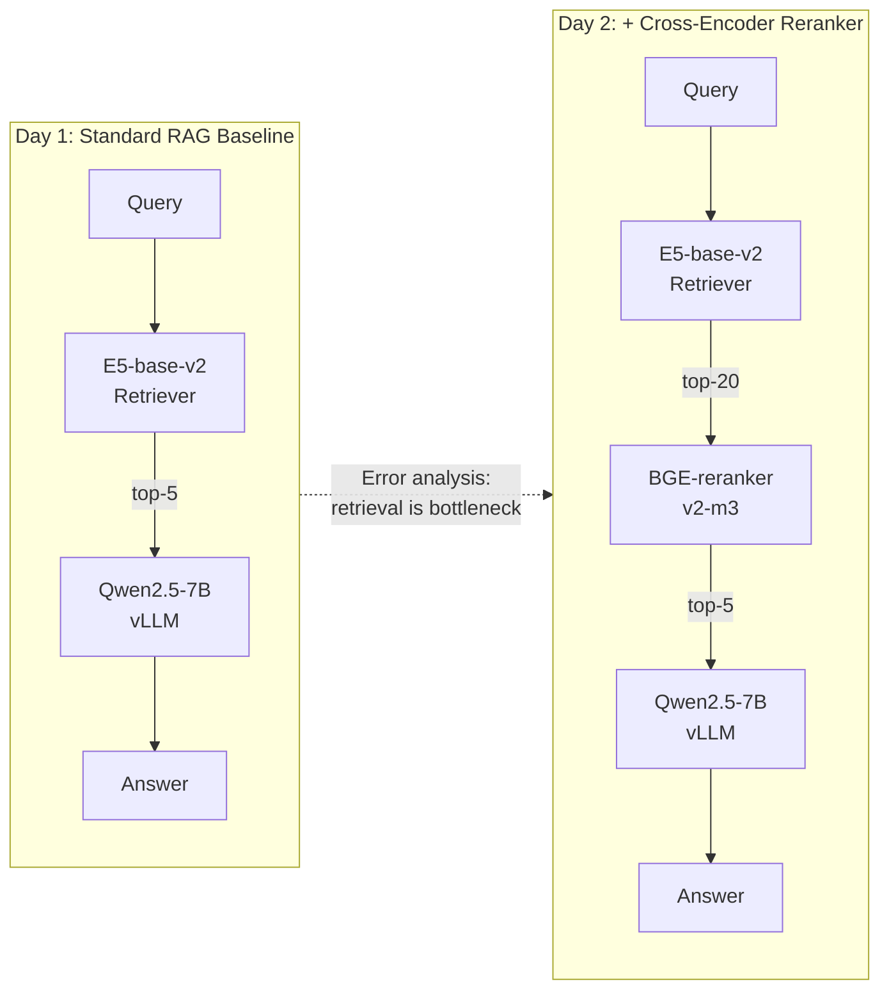

## Answer Quality: F1 Scores

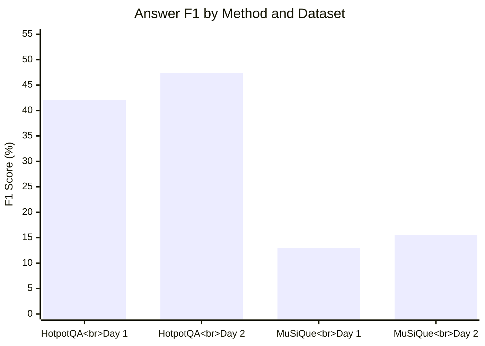

## Answer Quality: EM Scores

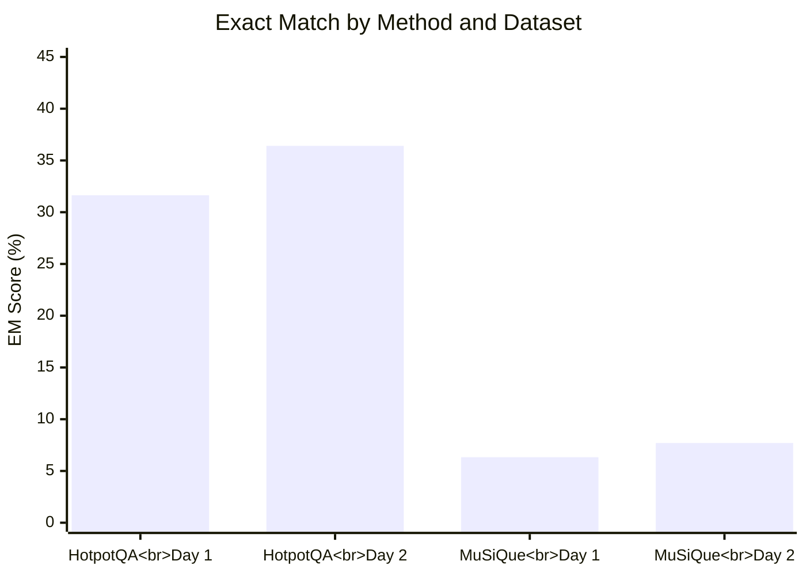

## Retrieval Recall@5

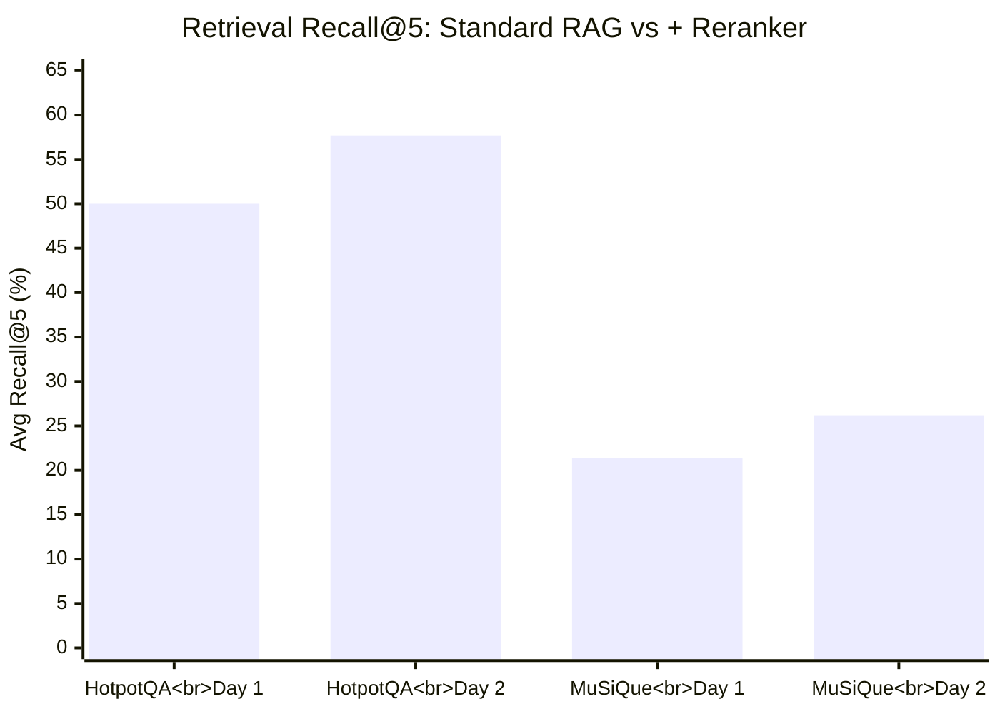

## MuSiQue Per-Hop Retrieval Recall

```mermaid
xychart-beta
    title "MuSiQue Per-Hop Recall: Day 1 vs Day 2"
    x-axis ["Hop 1", "Hop 2", "Hop 3", "Hop 4"]
    y-axis "Recall (%)" 0 --> 45
    bar "Day 1 (Standard RAG)" [33.5, 11.6, 6.5, 3.2]
    bar "Day 2 (+ Reranker)" [39.6, 14.8, 12.4, 4.7]
```

## HotpotQA Error Categorization Shift

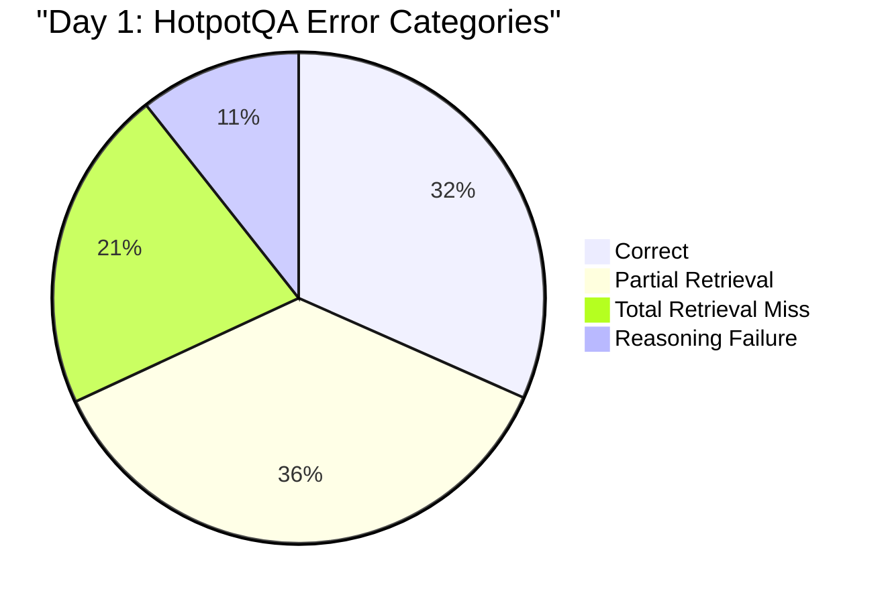

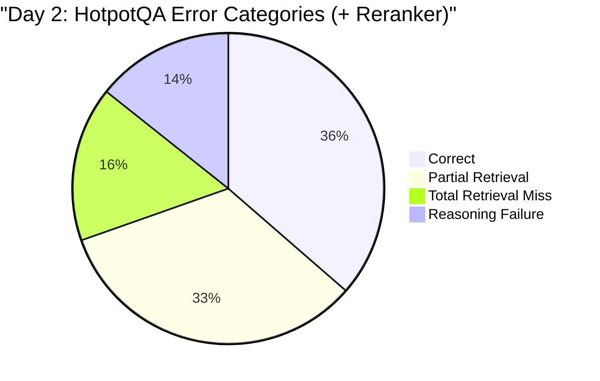

## MuSiQue Error Categorization Shift

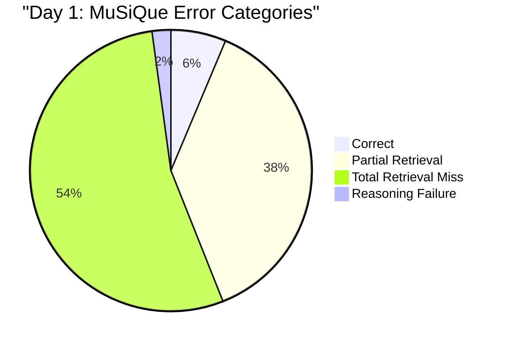

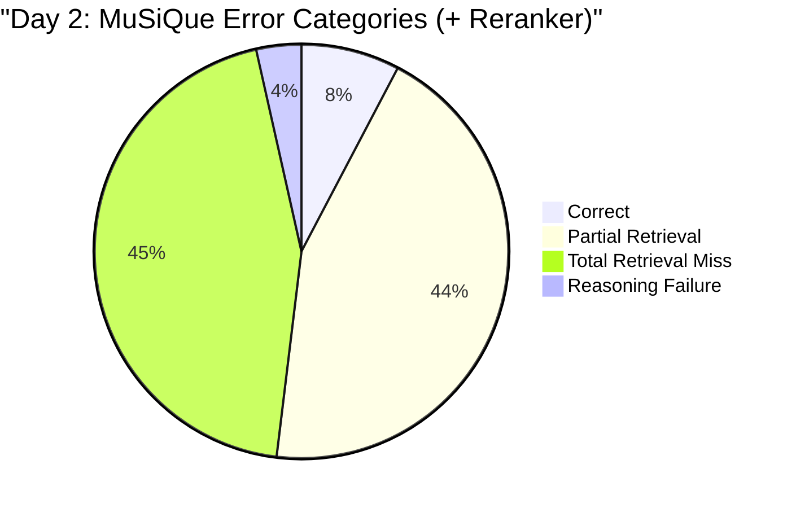

## Key Findings Flow

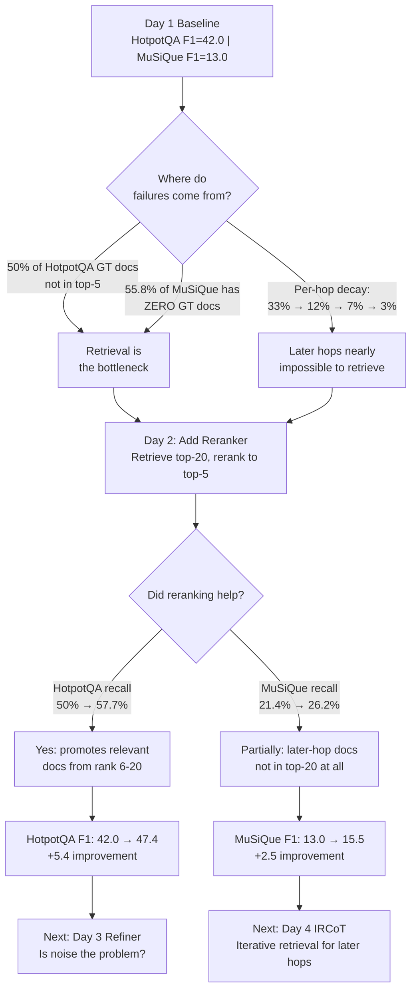

## Component Stack Progress

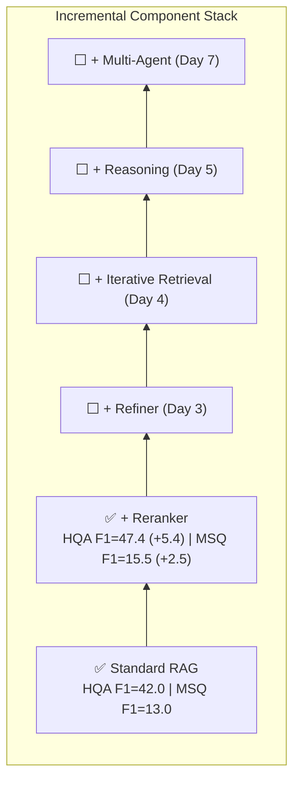
