# Incremental RAG Component Analysis: Visual Summary

## Experiment Progression (Days 1-3)

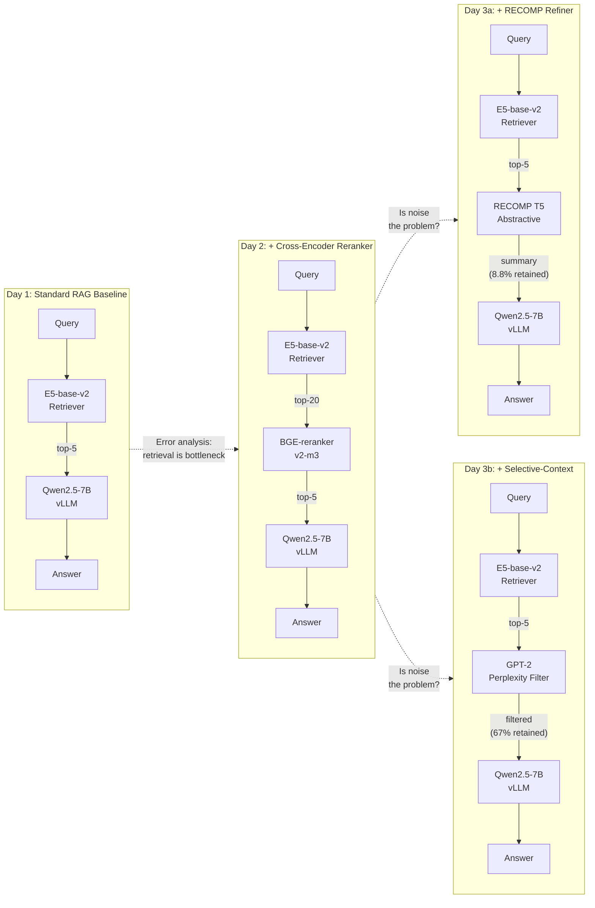

## HotpotQA F1: All Methods

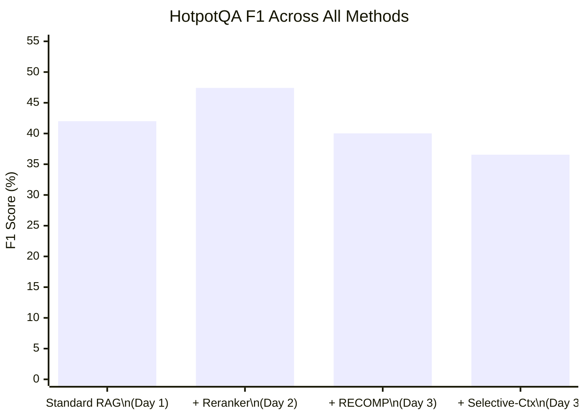

## MuSiQue F1: All Methods

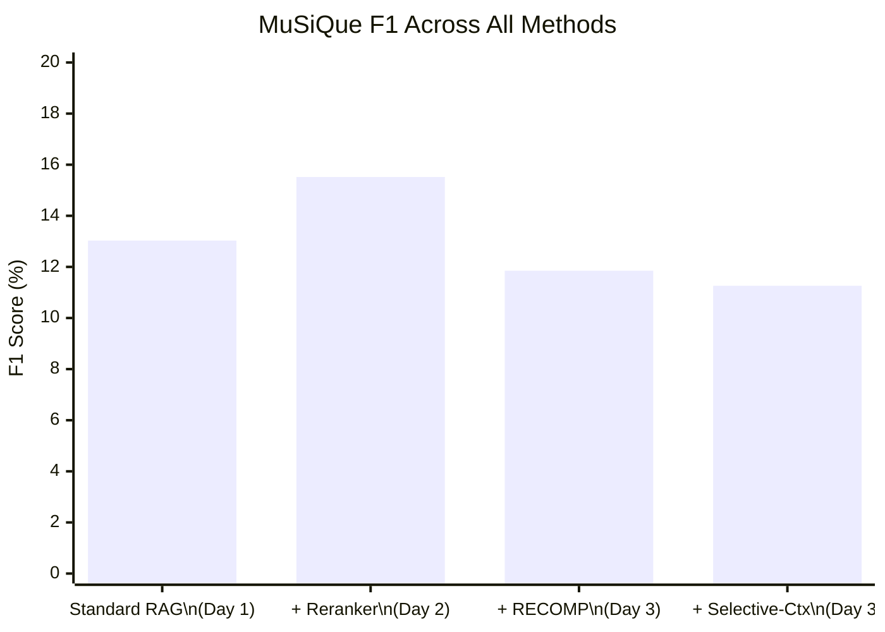

## F1 Delta from Baseline (Day 1)

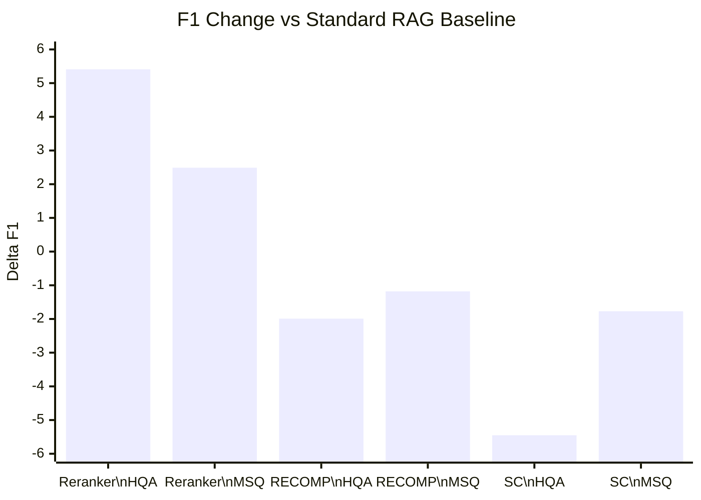

## Compression Ratio vs F1 Impact

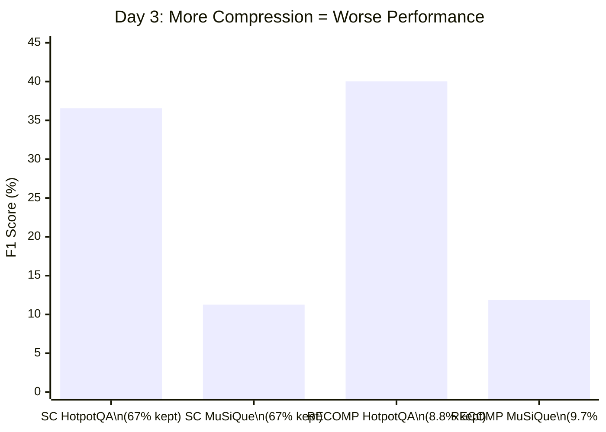

## Retrieval Recall@5

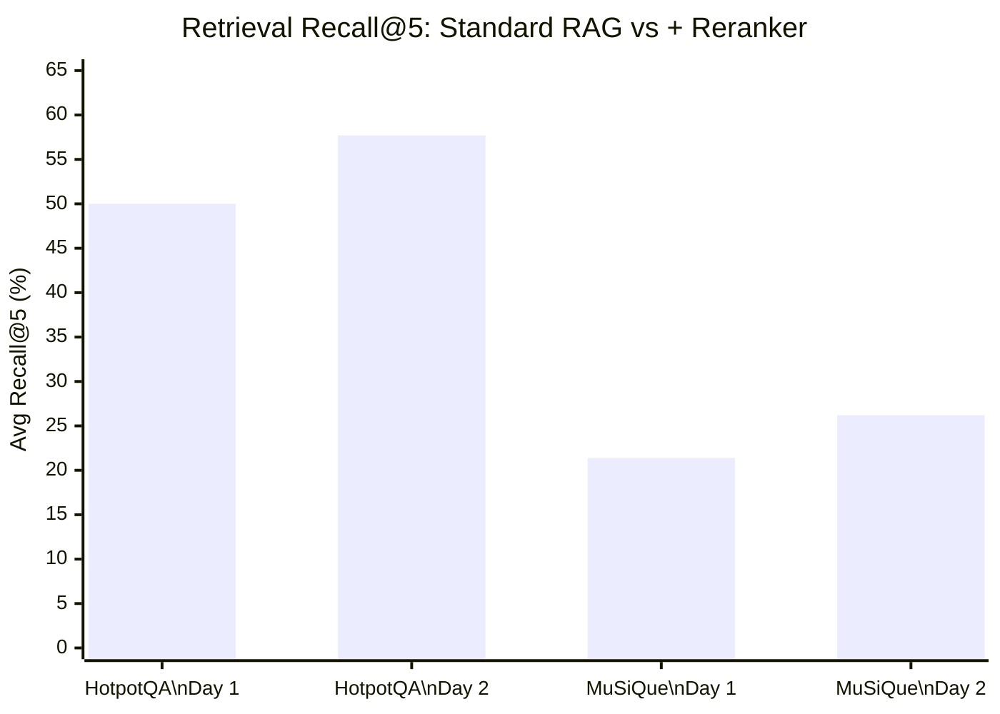

## MuSiQue Per-Hop Retrieval Recall

```mermaid
xychart-beta
    title "MuSiQue Per-Hop Recall: Day 1 vs Day 2"
    x-axis ["Hop 1", "Hop 2", "Hop 3", "Hop 4"]
    y-axis "Recall (%)" 0 --> 45
    bar "Day 1 (Standard RAG)" [33.5, 11.6, 6.5, 3.2]
    bar "Day 2 (+ Reranker)" [39.6, 14.8, 12.4, 4.7]
```

## HotpotQA Error Categorization Shift

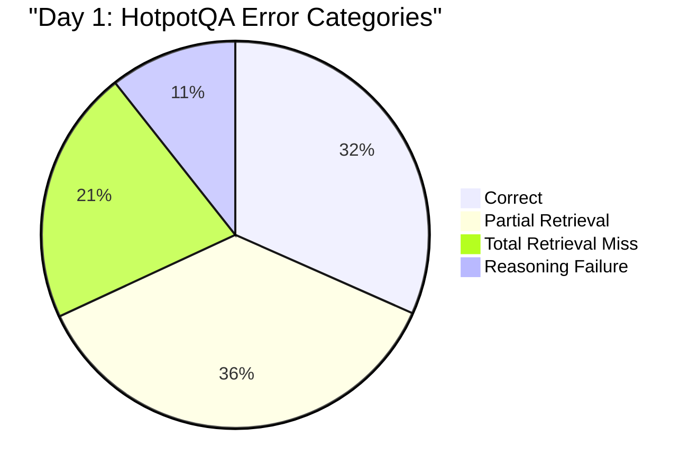

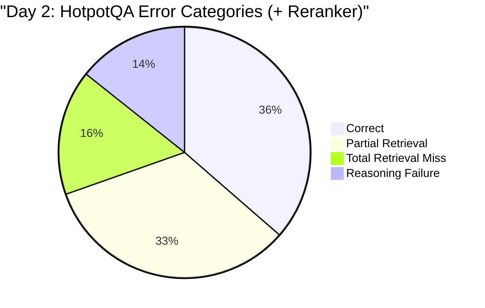

## MuSiQue Error Categorization Shift

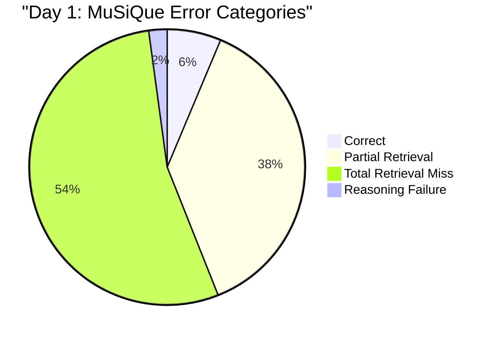

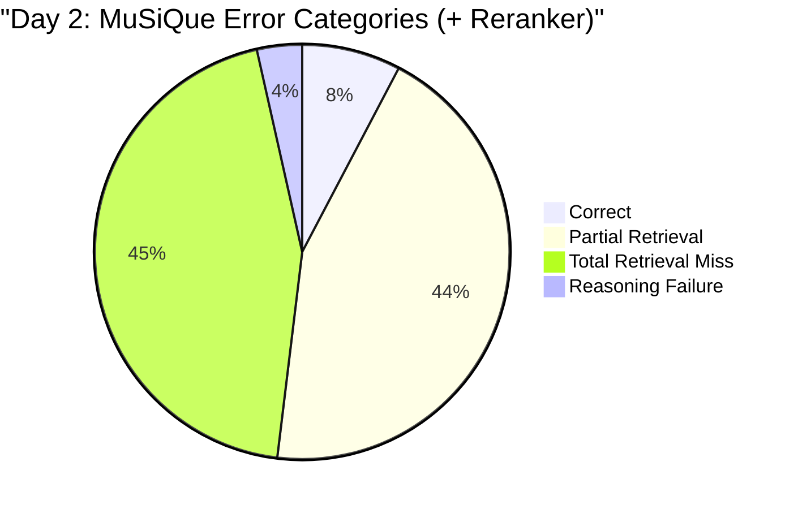

## Key Findings Flow (Days 1-3)

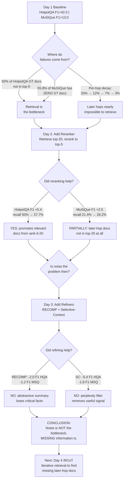

## Component Stack Progress

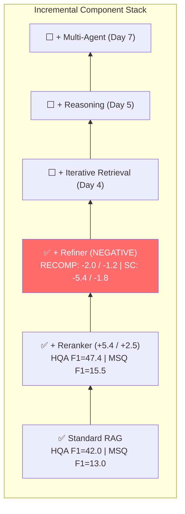

## Day 3: Refining Time Breakdown

```mermaid
xychart-beta
    title "Day 3: Time Breakdown (seconds)"
    x-axis ["RECOMP\nHotpotQA", "RECOMP\nMuSiQue", "SC\nHotpotQA", "SC\nMuSiQue"]
    y-axis "Time (seconds)" 0 --> 10500
    bar "Retrieval" [212, 175, 229, 175]
    bar "Refining" [9957, 3456, 2717, 868]
    bar "Generation" [48, 17, 228, 73]
```
