# Incremental RAG Component Analysis: Visual Summary

## Experiment Progression (Days 1-5)

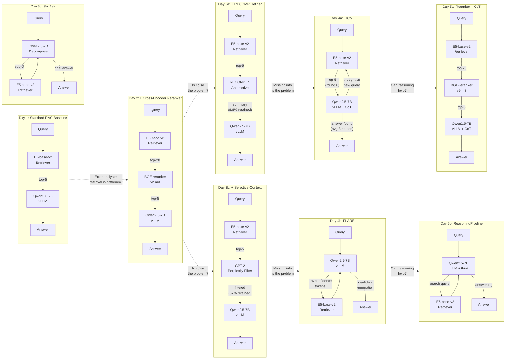
```mermaid
flowchart LR
    subgraph Day1["Day 1: Standard RAG Baseline"]
        A[Query] --> B["E5-base-v2\nRetriever"]
        B -->|top-5| C["Qwen2.5-7B\nvLLM"]
        C --> D[Answer]
    end

    subgraph Day2["Day 2: + Cross-Encoder Reranker"]
        E[Query] --> F["E5-base-v2\nRetriever"]
        F -->|top-20| G["BGE-reranker\nv2-m3"]
        G -->|top-5| H["Qwen2.5-7B\nvLLM"]
        H --> I[Answer]
    end

    subgraph Day3a["Day 3a: + RECOMP Refiner"]
        J[Query] --> K["E5-base-v2\nRetriever"]
        K -->|top-5| L["RECOMP T5\nAbstractive"]
        L -->|"summary\n(8.8% retained)"| M["Qwen2.5-7B\nvLLM"]
        M --> N[Answer]
    end

    subgraph Day3b["Day 3b: + Selective-Context"]
        O[Query] --> P["E5-base-v2\nRetriever"]
        P -->|top-5| Q["GPT-2\nPerplexity Filter"]
        Q -->|"filtered\n(67% retained)"| R["Qwen2.5-7B\nvLLM"]
        R --> S[Answer]
    end

    subgraph Day4a["Day 4a: IRCoT"]
        T[Query] --> U["E5-base-v2\nRetriever"]
        U -->|"top-5\n(round 0)"| V["Qwen2.5-7B\nvLLM + CoT"]
        V -->|"thought as\nnew query"| U
        V -->|"answer found\n(avg 3 rounds)"| W[Answer]
    end

    subgraph Day4b["Day 4b: FLARE"]
        X[Query] --> Y["Qwen2.5-7B\nvLLM"]
        Y -->|"low confidence\ntokens"| Z["E5-base-v2\nRetriever"]
        Z --> Y
        Y -->|"confident\ngeneration"| AA[Answer]
    end

    subgraph Day5a["Day 5a: Reranker + CoT"]
        AB[Query] --> AC["E5-base-v2\nRetriever"]
        AC -->|top-20| AD["BGE-reranker\nv2-m3"]
        AD -->|top-5| AE["Qwen2.5-7B\nvLLM + CoT"]
        AE --> AF[Answer]
    end

    subgraph Day5b["Day 5b: ReasoningPipeline"]
        AG[Query] --> AH["Qwen2.5-7B\nvLLM + think"]
        AH -->|"search query"| AI["E5-base-v2\nRetriever"]
        AI --> AH
        AH -->|"answer tag"| AJ[Answer]
    end

    subgraph Day5c["Day 5c: SelfAsk"]
        AK[Query] --> AL["Qwen2.5-7B\nDecompose"]
        AL -->|"sub-Q"| AM["E5-base-v2\nRetriever"]
        AM --> AL
        AL -->|"final answer"| AN[Answer]
    end

    Day1 -.->|"Error analysis:\nretrieval is bottleneck"| Day2
    Day2 -.->|"Is noise\nthe problem?"| Day3a
    Day2 -.->|"Is noise\nthe problem?"| Day3b
    Day3a -.->|"Missing info\nis the problem"| Day4a
    Day3b -.->|"Missing info\nis the problem"| Day4b
    Day4a -.->|"Can reasoning\nhelp?"| Day5a
    Day4b -.->|"Can reasoning\nhelp?"| Day5b
```

## HotpotQA F1: All Methods (Days 1-5)

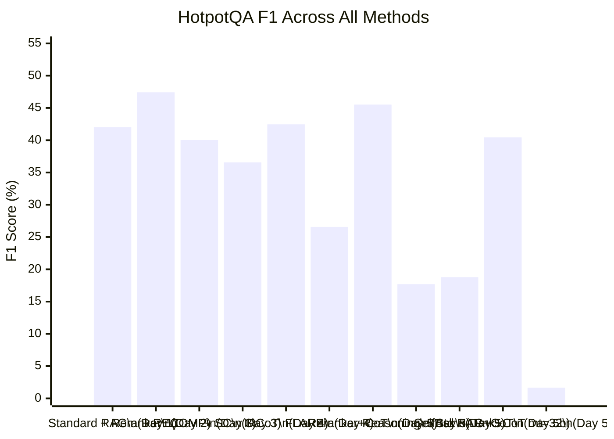
```mermaid
xychart-beta
    title "HotpotQA F1 Across All Methods"
    x-axis ["Standard RAG\n(Day 1)", "+ Reranker\n(Day 2)", "+ RECOMP\n(Day 3)", "+ SC\n(Day 3)", "IRCoT\n(Day 4)", "FLARE\n(Day 4)", "Reranker+CoT\n(Day 5)", "Reasoning\n(Day 5)", "SelfAsk\n(Day 5)", "Std RAG+CoT\n(Day 5b)", "Rnk+CoT mt=32\n(Day 5b)"]
    y-axis "F1 Score (%)" 0 --> 55
    bar [42.01, 47.42, 40.02, 36.56, 42.46, 26.57, 45.52, 17.70, 18.79, 40.44, 1.67]
```

## MuSiQue F1: All Methods (Days 1-5)

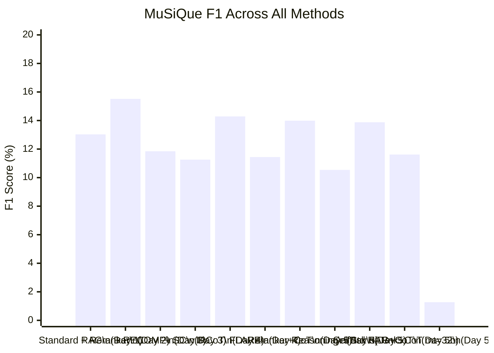
```mermaid
xychart-beta
    title "MuSiQue F1 Across All Methods"
    x-axis ["Standard RAG\n(Day 1)", "+ Reranker\n(Day 2)", "+ RECOMP\n(Day 3)", "+ SC\n(Day 3)", "IRCoT\n(Day 4)", "FLARE\n(Day 4)", "Reranker+CoT\n(Day 5)", "Reasoning\n(Day 5)", "SelfAsk\n(Day 5)", "Std RAG+CoT\n(Day 5b)", "Rnk+CoT mt=32\n(Day 5b)"]
    y-axis "F1 Score (%)" 0 --> 20
    bar [13.03, 15.52, 11.85, 11.26, 14.29, 11.44, 13.99, 10.54, 13.88, 11.62, 1.27]
```

## F1 Delta from Baseline (Day 1) - All Methods

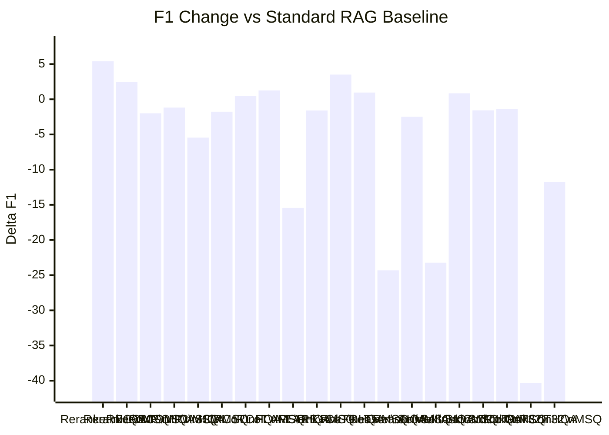
```mermaid
xychart-beta
    title "F1 Change vs Standard RAG Baseline"
    x-axis ["Reranker\nHQA", "Reranker\nMSQ", "RECOMP\nHQA", "RECOMP\nMSQ", "SC\nHQA", "SC\nMSQ", "IRCoT\nHQA", "IRCoT\nMSQ", "FLARE\nHQA", "FLARE\nMSQ", "Rnk+CoT\nHQA", "Rnk+CoT\nMSQ", "Reason\nHQA", "Reason\nMSQ", "SelfAsk\nHQA", "SelfAsk\nMSQ", "StdCoT\nHQA", "StdCoT\nMSQ", "RnkCoT32\nHQA", "RnkCoT32\nMSQ"]
    y-axis "Delta F1" -42 --> 8
    bar [5.41, 2.49, -1.99, -1.18, -5.45, -1.77, 0.45, 1.26, -15.44, -1.59, 3.51, 0.96, -24.31, -2.49, -23.22, 0.85, -1.57, -1.41, -40.34, -11.76]
```

## IRCoT Retrieval Recall Progression (HotpotQA)

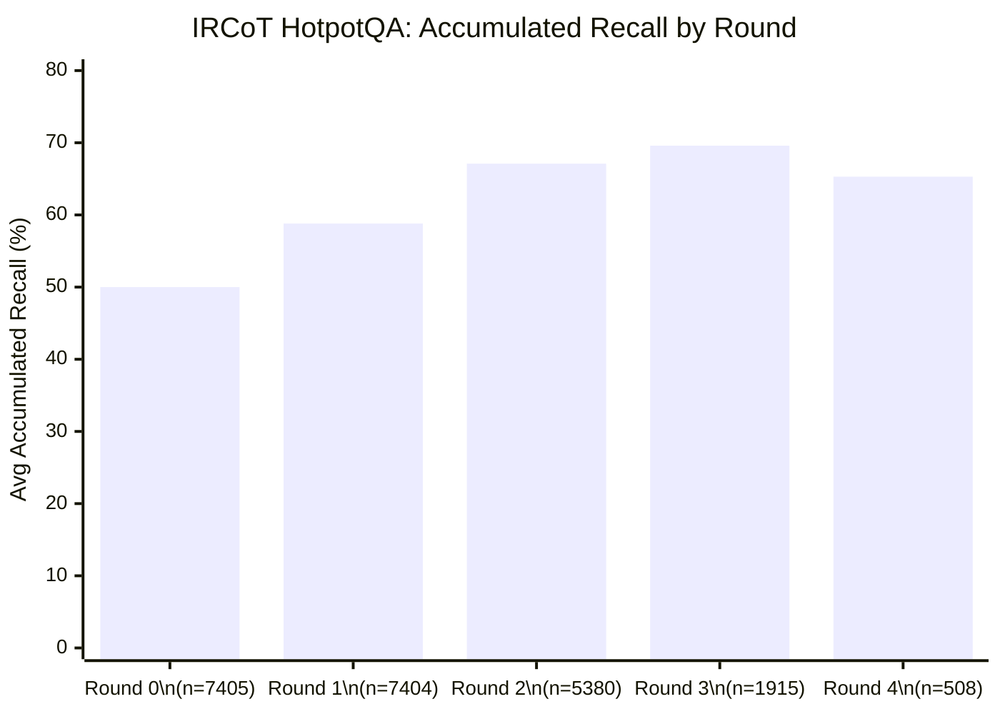
```mermaid
xychart-beta
    title "IRCoT HotpotQA: Accumulated Recall by Round"
    x-axis ["Round 0\n(n=7405)", "Round 1\n(n=7404)", "Round 2\n(n=5380)", "Round 3\n(n=1915)", "Round 4\n(n=508)"]
    y-axis "Avg Accumulated Recall (%)" 0 --> 80
    bar [50.0, 58.8, 67.1, 69.6, 65.3]
```

## IRCoT Retrieval Recall Progression (MuSiQue)

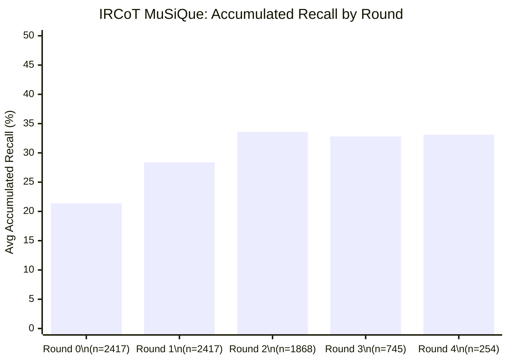
```mermaid
xychart-beta
    title "IRCoT MuSiQue: Accumulated Recall by Round"
    x-axis ["Round 0\n(n=2417)", "Round 1\n(n=2417)", "Round 2\n(n=1868)", "Round 3\n(n=745)", "Round 4\n(n=254)"]
    y-axis "Avg Accumulated Recall (%)" 0 --> 50
    bar [21.4, 28.4, 33.6, 32.8, 33.1]
```

## FLARE Retrieval Triggering Failure

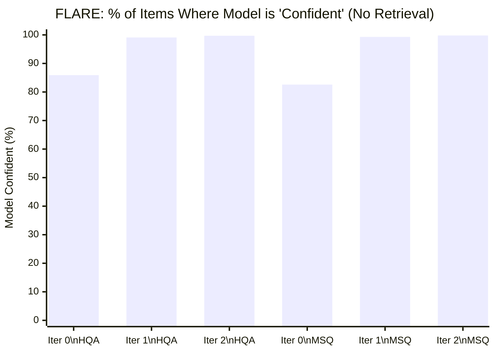
```mermaid
xychart-beta
    title "FLARE: % of Items Where Model is 'Confident' (No Retrieval)"
    x-axis ["Iter 0\nHQA", "Iter 1\nHQA", "Iter 2\nHQA", "Iter 0\nMSQ", "Iter 1\nMSQ", "Iter 2\nMSQ"]
    y-axis "Model Confident (%)" 0 --> 100
    bar [85.9, 99.1, 99.7, 82.6, 99.3, 99.8]
```

## Answer F1 by Retrieval Recall (IRCoT HotpotQA)

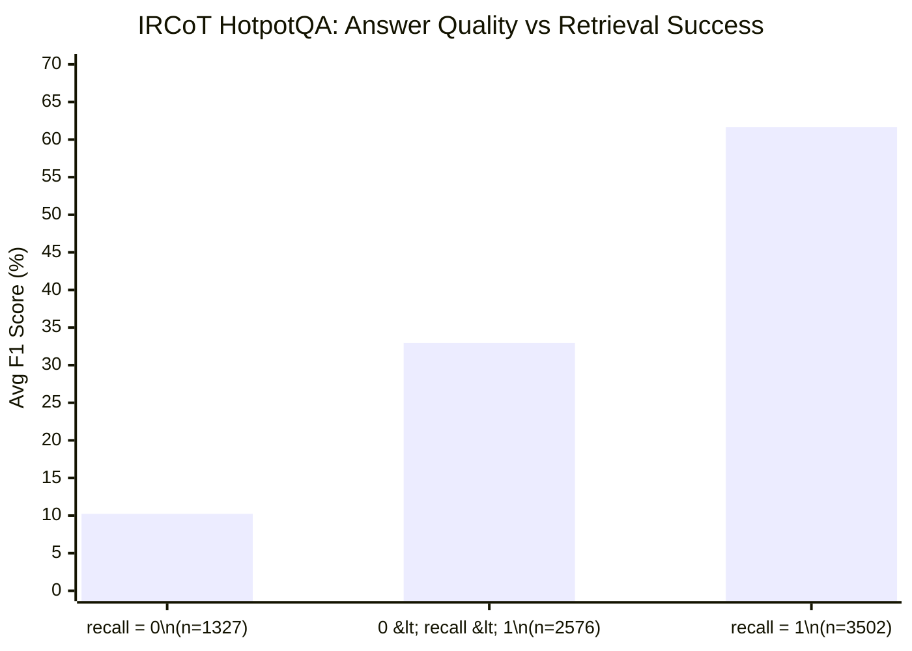
```mermaid
xychart-beta
    title "IRCoT HotpotQA: Answer Quality vs Retrieval Success"
    x-axis ["recall = 0\n(n=1327)", "0 < recall < 1\n(n=2576)", "recall = 1\n(n=3502)"]
    y-axis "Avg F1 Score (%)" 0 --> 70
    bar [10.24, 32.95, 61.66]
```

## MuSiQue Per-Hop Retrieval Recall Comparison

```mermaid
xychart-beta
    title "MuSiQue Per-Hop Recall: Day 1 vs Day 2 vs IRCoT (Day 4)"
    x-axis ["Hop 1", "Hop 2", "Hop 3", "Hop 4"]
    y-axis "Recall (%)" 0 --> 50
    bar "Day 1 (Standard RAG)" [33.5, 11.6, 6.5, 3.2]
    bar "Day 2 (+ Reranker)" [39.6, 14.8, 12.4, 4.7]
    bar "Day 4 (IRCoT)" [46.3, 24.9, 15.1, 7.2]
```

## Compression Ratio vs F1 Impact

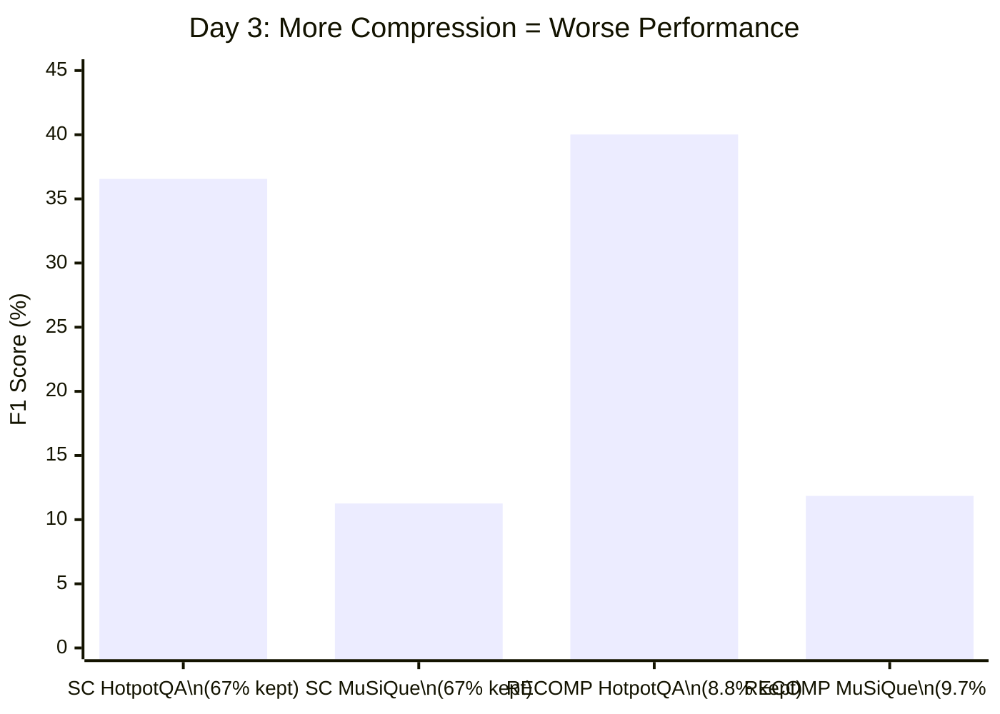
```mermaid
xychart-beta
    title "Day 3: More Compression = Worse Performance"
    x-axis ["SC HotpotQA\n(67% kept)", "SC MuSiQue\n(67% kept)", "RECOMP HotpotQA\n(8.8% kept)", "RECOMP MuSiQue\n(9.7% kept)"]
    y-axis "F1 Score (%)" 0 --> 45
    bar [36.56, 11.26, 40.02, 11.85]
```

## Retrieval Recall@5 Comparison

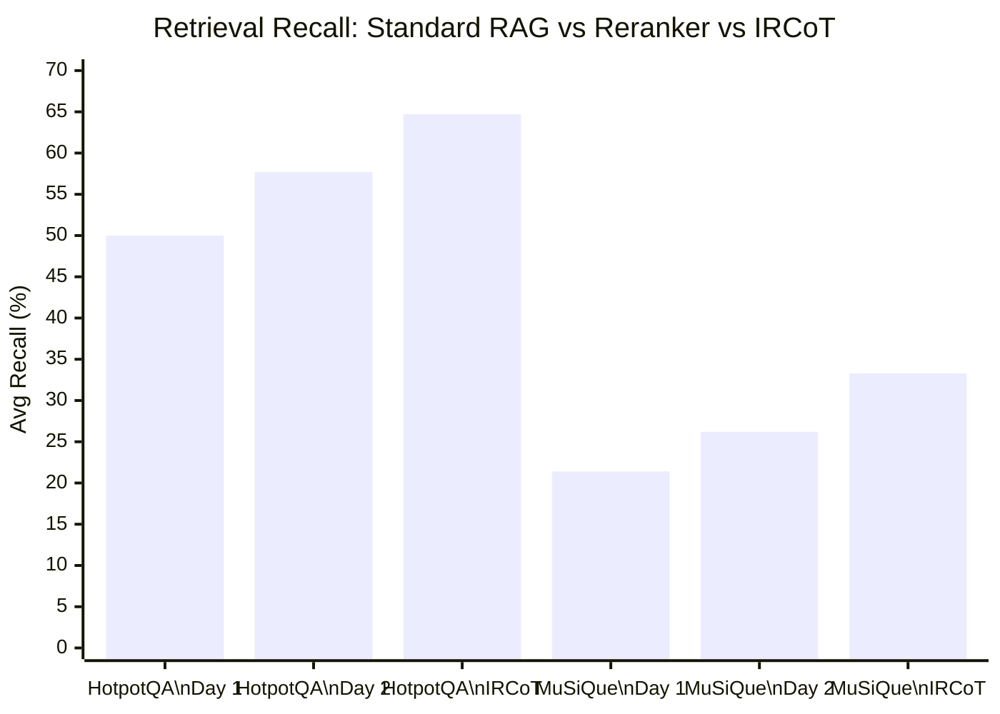
```mermaid
xychart-beta
    title "Retrieval Recall: Standard RAG vs Reranker vs IRCoT"
    x-axis ["HotpotQA\nDay 1", "HotpotQA\nDay 2", "HotpotQA\nIRCoT", "MuSiQue\nDay 1", "MuSiQue\nDay 2", "MuSiQue\nIRCoT"]
    y-axis "Avg Recall (%)" 0 --> 70
    bar [50.0, 57.7, 64.7, 21.4, 26.2, 33.3]
```

## HotpotQA Error Categorization Shift (Days 1-4)

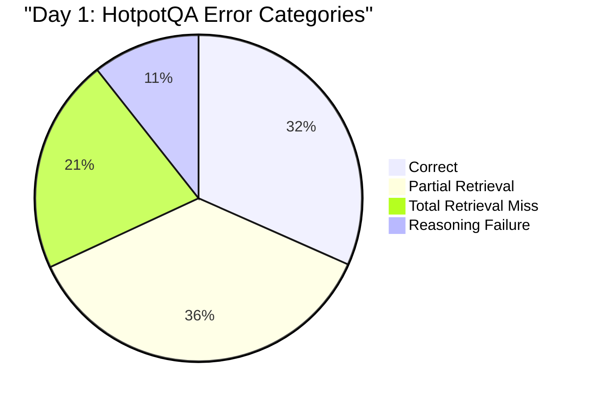
```mermaid
pie title "Day 1: HotpotQA Error Categories"
    "Correct" : 2343
    "Partial Retrieval" : 2698
    "Total Retrieval Miss" : 1577
    "Reasoning Failure" : 787
```

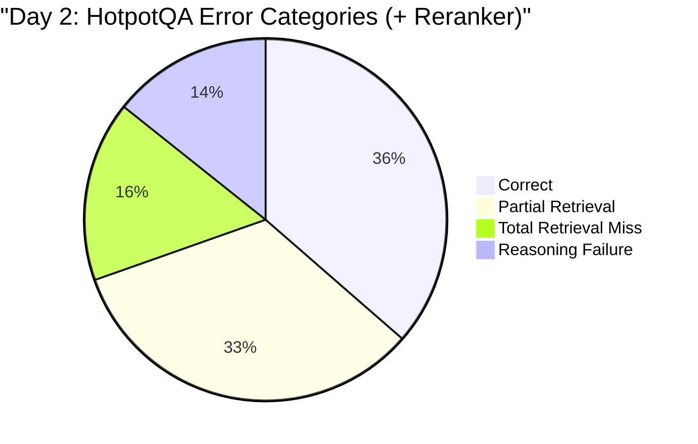
```mermaid
pie title "Day 2: HotpotQA Error Categories (+ Reranker)"
    "Correct" : 2696
    "Partial Retrieval" : 2458
    "Total Retrieval Miss" : 1193
    "Reasoning Failure" : 1058
```

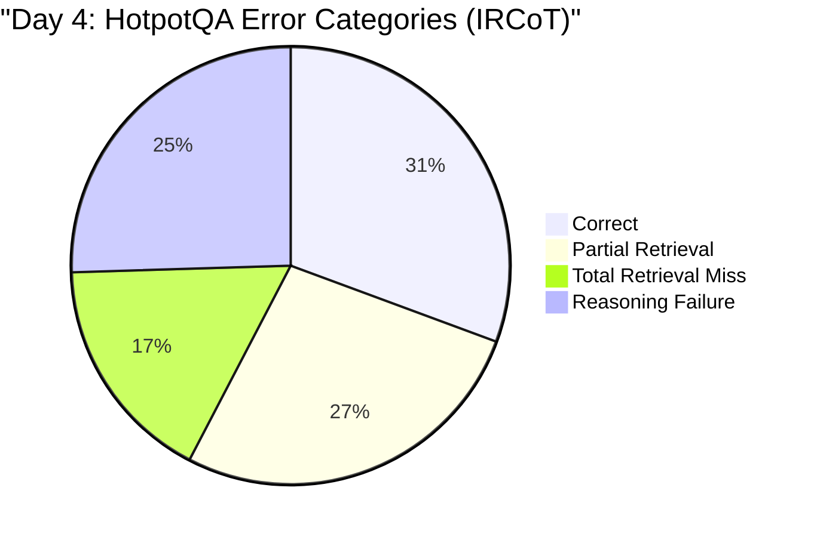
```mermaid
pie title "Day 4: HotpotQA Error Categories (IRCoT)"
    "Correct" : 2269
    "Partial Retrieval" : 1999
    "Total Retrieval Miss" : 1250
    "Reasoning Failure" : 1887
```

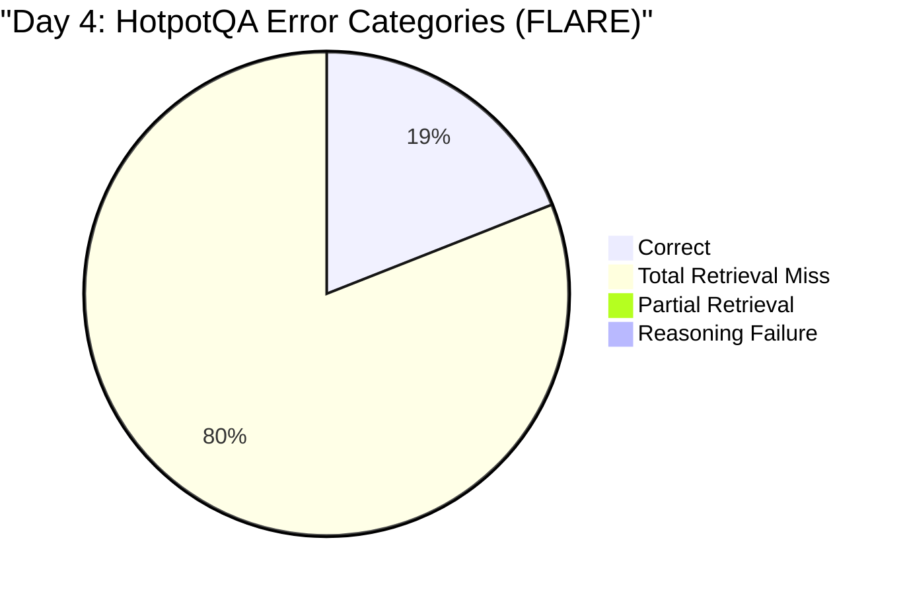
```mermaid
pie title "Day 4: HotpotQA Error Categories (FLARE)"
    "Correct" : 1396
    "Total Retrieval Miss" : 5953
    "Partial Retrieval" : 51
    "Reasoning Failure" : 5
```

## MuSiQue Error Categorization Shift (Days 1-4)

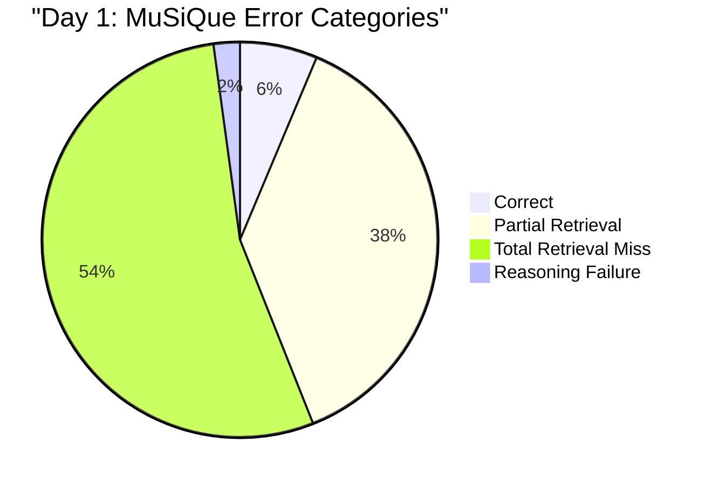
```mermaid
pie title "Day 1: MuSiQue Error Categories"
    "Correct" : 153
    "Partial Retrieval" : 910
    "Total Retrieval Miss" : 1302
    "Reasoning Failure" : 52
```

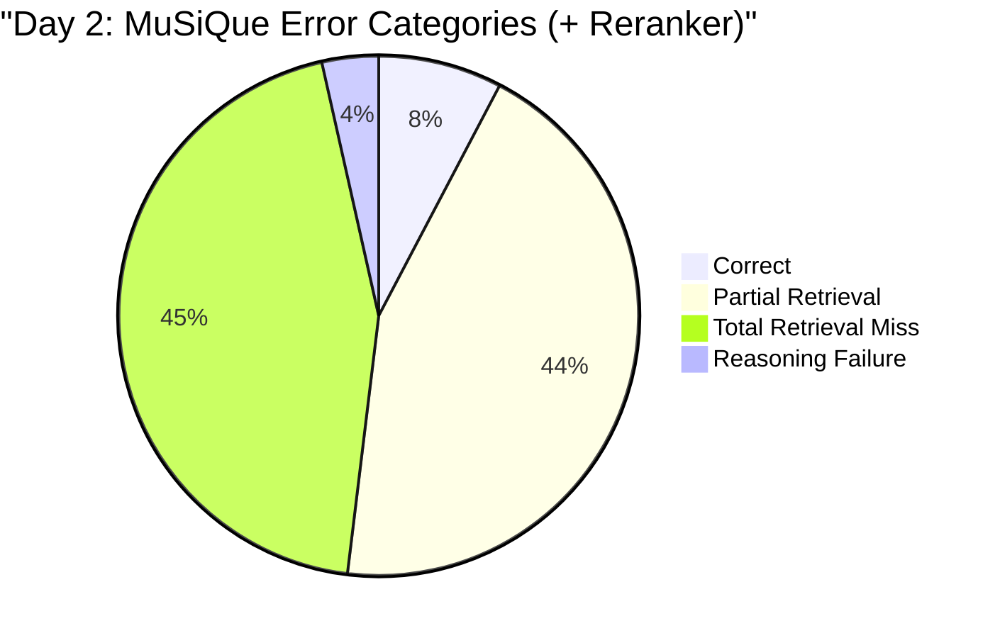
```mermaid
pie title "Day 2: MuSiQue Error Categories (+ Reranker)"
    "Correct" : 186
    "Partial Retrieval" : 1069
    "Total Retrieval Miss" : 1077
    "Reasoning Failure" : 85
```

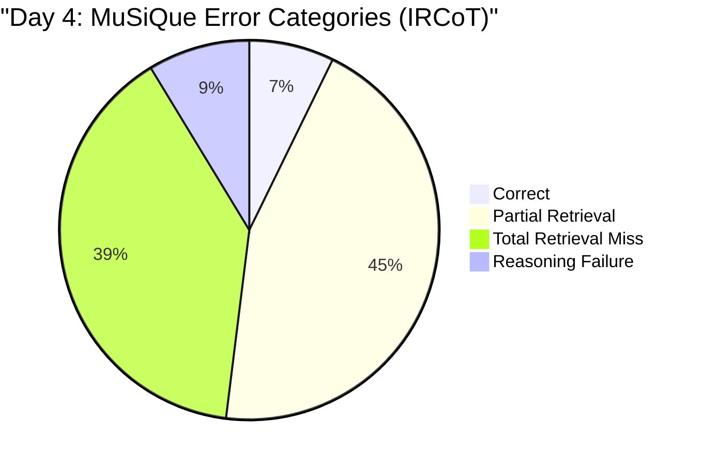
```mermaid
pie title "Day 4: MuSiQue Error Categories (IRCoT)"
    "Correct" : 175
    "Partial Retrieval" : 1081
    "Total Retrieval Miss" : 951
    "Reasoning Failure" : 210
```

## Day 5: Single-Agent Reasoning Approaches

### Reranker + CoT Answer Extraction Issue

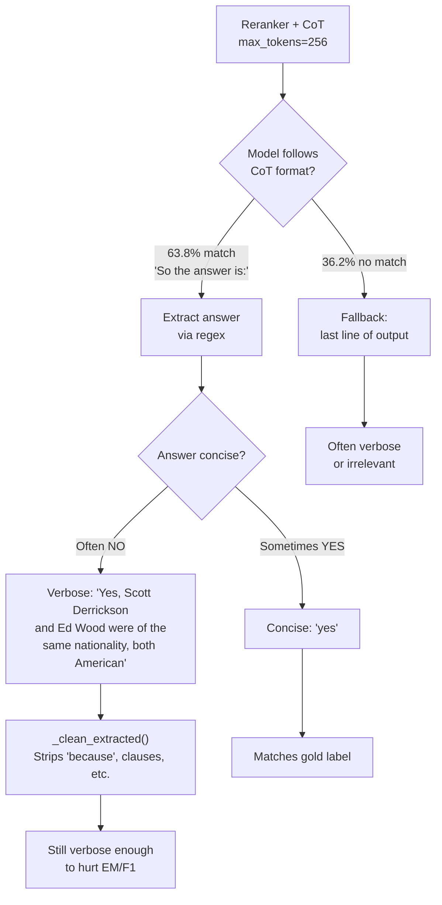
```mermaid
flowchart TD
    A["Reranker + CoT\nmax_tokens=256"] --> B{"Model follows\nCoT format?"}
    B -->|"63.8% match\n'So the answer is:'"| C["Extract answer\nvia regex"]
    B -->|"36.2% no match"| D["Fallback:\nlast line of output"]
    C --> E{"Answer concise?"}
    E -->|"Often NO"| F["Verbose: 'Yes, Scott Derrickson\nand Ed Wood were of the\nsame nationality, both American'"]
    E -->|"Sometimes YES"| G["Concise: 'yes'"]
    F --> H["_clean_extracted()\nStrips 'because', clauses, etc."]
    H --> I["Still verbose enough\nto hurt EM/F1"]
    G --> J["Matches gold label"]
    D --> K["Often verbose\nor irrelevant"]
```

### ReasoningPipeline Search Triggering

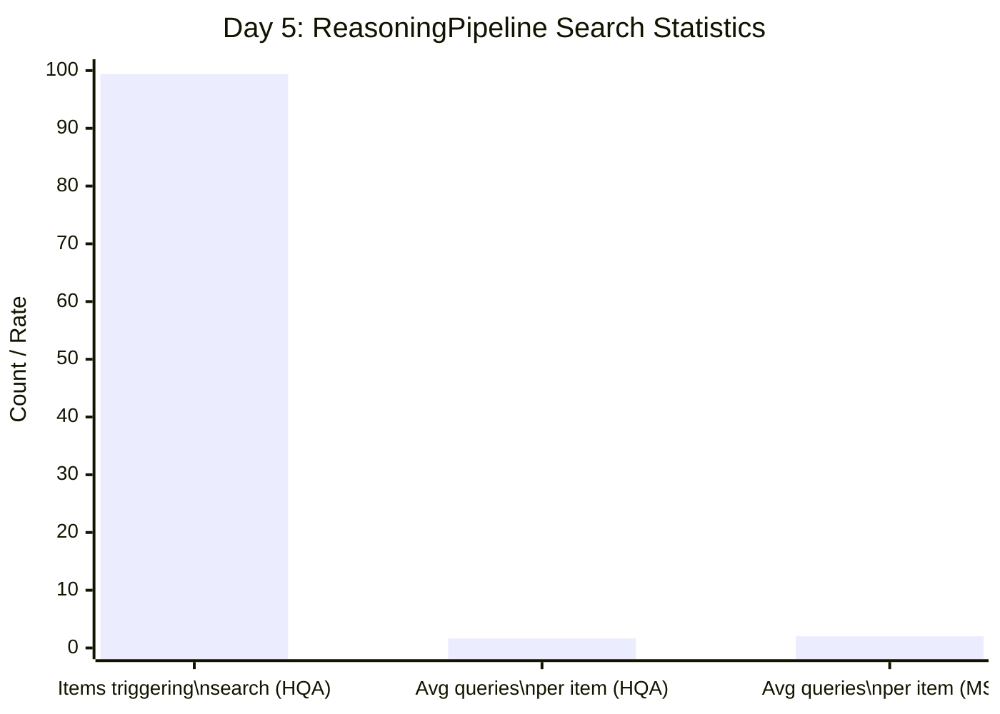
```mermaid
xychart-beta
    title "Day 5: ReasoningPipeline Search Statistics"
    x-axis ["Items triggering\nsearch (HQA)", "Avg queries\nper item (HQA)", "Avg queries\nper item (MSQ)"]
    y-axis "Count / Rate" 0 --> 100
    bar [99.4, 1.64, 2.02]
```

### Day 5 HotpotQA F1 Comparison

```mermaid
xychart-beta
    title "Day 5 Methods vs Reranker Ceiling (HotpotQA F1)"
    x-axis ["Day 2: Reranker\n(CEILING)", "Day 5: Reranker+CoT", "Day 5b: Std RAG+CoT", "Day 5b: Rnk+CoT mt=32", "Day 5: Reasoning", "Day 5: SelfAsk"]
    y-axis "F1 Score (%)" 0 --> 55
    bar [47.42, 45.52, 40.44, 1.67, 17.70, 18.79]
```

### Day 5 MuSiQue F1 Comparison

```mermaid
xychart-beta
    title "Day 5 Methods vs Reranker Ceiling (MuSiQue F1)"
    x-axis ["Day 2: Reranker\n(CEILING)", "Day 5: Reranker+CoT", "Day 5b: Std RAG+CoT", "Day 5b: Rnk+CoT mt=32", "Day 5: Reasoning", "Day 5: SelfAsk"]
    y-axis "F1 Score (%)" 0 --> 20
    bar [15.52, 13.99, 11.62, 1.27, 10.54, 13.88]
```

### Day 5 Latency Comparison

```mermaid
xychart-beta
    title "Day 5: Time per Example (seconds)"
    x-axis ["Standard RAG\n(Day 1)", "Reranker+CoT\n(Day 5)", "ReasoningPipeline\n(Day 5)", "SelfAsk\n(Day 5)"]
    y-axis "Seconds per Example" 0 --> 12
    bar [0.11, 0.30, 0.27, 11.11]
```

## Day 5b: 2x2 Factorial Design (Feb 9) — Isolating CoT Effect

### 2x2 Factorial: CoT x Reranker (HotpotQA F1)

```mermaid
xychart-beta
    title "2x2 Factorial: CoT x Reranker (HotpotQA F1)"
    x-axis ["No CoT, No Reranker\n(Day 1)", "CoT, No Reranker\n(Day 5b)", "No CoT, + Reranker\n(Day 2)", "CoT, + Reranker\n(Day 5)"]
    y-axis "F1 Score (%)" 0 --> 55
    bar [42.01, 40.44, 47.42, 45.52]
```

### 2x2 Factorial: CoT x Reranker (MuSiQue F1)

```mermaid
xychart-beta
    title "2x2 Factorial: CoT x Reranker (MuSiQue F1)"
    x-axis ["No CoT, No Reranker\n(Day 1)", "CoT, No Reranker\n(Day 5b)", "No CoT, + Reranker\n(Day 2)", "CoT, + Reranker\n(Day 5)"]
    y-axis "F1 Score (%)" 0 --> 20
    bar [13.03, 11.62, 15.52, 13.99]
```

### max_tokens=32 + CoT: Catastrophic Failure

```mermaid
xychart-beta
    title "Reranker + CoT: max_tokens=32 vs 256 (F1)"
    x-axis ["Reranker only\nmt=32 (Day 2)", "Reranker+CoT\nmt=256 (Day 5)", "Reranker+CoT\nmt=32 (Day 5b)"]
    y-axis "F1 Score (%)" 0 --> 55
    bar "HotpotQA" [47.42, 45.52, 1.67]
    bar "MuSiQue" [15.52, 13.99, 1.27]
```

**Why max_tokens=32 + CoT = EM 0.0%:**
With a CoT prompt asking for step-by-step reasoning, 32 tokens are entirely consumed by the reasoning trace.
Sample output: `"2. Doc 1 provides information about Ed"` — the model never reaches the actual answer.
This confirms CoT needs token headroom; when constrained, it's worse than useless.

### Factorial Conclusions
1. **CoT effect = consistently -1.5 to -2.0 F1** (independent of reranker)
2. **Reranker effect = consistently +5.0 to +5.4 F1** (independent of CoT)
3. **No interaction effect** — reranker and CoT operate on orthogonal dimensions (retrieval vs generation)
4. **max_tokens is a critical confound** — CoT with 32 tokens = catastrophic; with 256 tokens = mildly harmful
5. **Single-agent ceiling confirmed at Day 2 Reranker**: F1=47.42 (HQA), F1=15.52 (MSQ)

## Key Findings Flow (Days 1-5)

```mermaid
flowchart TD
    A["Day 1 Baseline\nHotpotQA F1=42.0 | MuSiQue F1=13.0"] --> B{"Where do\nfailures come from?"}
    B -->|"50% of HotpotQA GT docs\nnot in top-5"| C["Retrieval is\nthe bottleneck"]
    B -->|"55.8% of MuSiQue has\nZERO GT docs"| C
    B -->|"Per-hop decay:\n33% > 12% > 7% > 3%"| D["Later hops nearly\nimpossible to retrieve"]

    C --> E["Day 2: Add Reranker\nRetrieve top-20, rerank to top-5"]
    D --> E

    E --> F{"Did reranking help?"}
    F -->|"HotpotQA F1 +5.4\nrecall 50% > 57.7%"| G["YES: promotes relevant\ndocs from rank 6-20"]
    F -->|"MuSiQue F1 +2.5\nrecall 21.4% > 26.2%"| H["PARTIALLY: later-hop docs\nnot in top-20 at all"]

    G --> I{"Is noise the\nproblem then?"}
    H --> I

    I --> J["Day 3: Add Refiners\nRECOMP + Selective-Context"]

    J --> K{"Did refining help?"}
    K -->|"RECOMP: -2.0 F1 HQA\n-1.2 F1 MSQ"| L["NO: abstractive summary\nloses critical facts"]
    K -->|"SC: -5.4 F1 HQA\n-1.8 F1 MSQ"| M["NO: perplexity filter\nremoves useful signal"]

    L --> N["CONCLUSION:\nNoise is NOT the bottleneck.\nMISSING information is."]
    M --> N

    N --> O["Day 4: Iterative Retrieval\nIRCoT + FLARE"]

    O --> P{"Did iterative\nretrieval help?"}
    P -->|"IRCoT: +0.45 F1 HQA\n+1.26 F1 MSQ"| Q["MARGINAL: recall 50%>65%\nbut answer quality flat"]
    P -->|"FLARE: -15.4 F1 HQA\n-1.6 F1 MSQ"| R["NO: model overconfidence\nblocks retrieval triggering"]

    Q --> S["IRCoT insight:\nCoT queries help recall\nbut context dilution\nneutralizes gains"]
    R --> T["FLARE insight:\nInstruction-tuned LLMs\nare overconfident;\nconfidence != knowledge"]

    S --> U["KEY FINDING:\nRetrieval ceiling is the\nbinding constraint.\nF1=61.7% when recall=100%\nvs F1=10.2% when recall=0%"]
    T --> U

    U --> V["Day 5: Single-Agent Reasoning"]

    V --> W{"Can advanced prompting\nor reasoning help?"}
    W -->|"Reranker+CoT: -1.9 F1 HQA\n-1.6 F1 MSQ"| X["NO: CoT produces verbose\nanswers that hurt extractive QA"]
    W -->|"Std RAG+CoT: -1.6 F1 HQA\n-1.4 F1 MSQ"| X2["NO: CoT hurts independently\nof reranker (2x2 factorial)"]
    W -->|"Rnk+CoT mt=32: -40.3 F1\nEM=0.0%"| X3["CATASTROPHIC: 32 tokens\nall reasoning, no answer"]
    W -->|"ReasoningPipeline: -29.7 F1 HQA\n-5.0 F1 MSQ"| Y["NO: Needs RL-trained model;\nQwen2.5 produces unextractable answers"]
    W -->|"SelfAsk: -28.6 F1 HQA\n+0.9 F1 MSQ"| Z["MARGINAL: decomposition\nhelps multi-hop slightly\nbut 100x slower"]

    X --> AA["SINGLE-AGENT CEILING\n= Day 2 Reranker\nHQA F1=47.4 | MSQ F1=15.5"]
    X2 --> AA
    X3 --> AA
    Y --> AA
    Z --> AA

    AA --> BB["Day 6: Bounding Experiments\nNaive Gen (lower) + Gold Context (upper)\n+ 2WikiMultihopQA (3rd dataset)\n+ Bootstrap CIs + Error Taxonomy"]

    BB --> CC["REMAINING GAP:\nHQA: 47.4→51.3 (3.9 F1)\nMSQ: 15.5→59.6 (44.1 F1)\n2Wiki: 34.8→70.0 (35.2 F1)"]

    CC --> DD["Ensemble Ceiling:\nHQA 61.1% | MSQ 24.8% | 2Wiki 41.2%\nMethods are COMPLEMENTARY\n→ Multi-agent routing has high value"]
```

## Component Stack Progress

```mermaid
flowchart BT
    subgraph stack["Incremental Component Stack"]
        direction BT
        S1["Day 1: Standard RAG\nHQA F1=42.0 | MSQ F1=13.0"]
        S2["Day 2: + Reranker (+5.4 / +2.5) -- SINGLE-AGENT CEILING\nHQA F1=47.4 | MSQ F1=15.5"]
        S3["Day 3: + Refiner (NEGATIVE)\nRECOMP: -2.0 / -1.2 | SC: -5.4 / -1.8"]
        S4["Day 4: Iterative Retrieval\nIRCoT: +0.5 / +1.3 | FLARE: -15.4 / -1.6"]
        S5["Day 5: + Reasoning (ALL NEGATIVE)\nCoT: -1.9 / -1.6 | Reasoning: -29.7 / -5.0 | SelfAsk: -28.6 / +0.9"]
        S6["Day 6: Bounding + Statistics\nNaive→Gold bounds | 2Wiki (3rd dataset) | Bootstrap CIs"]
        S7["Day 7: Multi-Agent Design\nMust close gap: HQA +3.9 | MSQ +44.1 | 2Wiki +35.2"]

        S1 --> S2 --> S3 --> S4 --> S5 --> S6 --> S7
    end

    style S2 fill:#2ecc71,color:#fff
    style S3 fill:#ff6b6b,color:#fff
    style S4 fill:#ffa500,color:#fff
    style S5 fill:#ff6b6b,color:#fff
    style S6 fill:#3498db,color:#fff
```

## Day 6: Performance Ladder with 95% Bootstrap CIs

| Method | HQA F1 [95% CI] | MSQ F1 [95% CI] | 2Wiki F1 [95% CI] |
|---|---|---|---|
| **Naive Gen (lower bound)** | 25.29 [24.45, 26.25] | 9.59 [8.63, 10.51] | 29.69 [28.97, 30.41] |
| Standard RAG (Day 1) | 42.01 [41.03, 43.04] | 13.03 [11.94, 14.18] | 32.13 [31.43, 32.91] |
| IRCoT (Day 4) | 42.61 [41.62, 43.64] | 14.29 [13.25, 15.48] | — |
| Reranker+CoT (Day 5) | 45.56 [44.58, 46.68] | — | — |
| **Reranker (Day 2, best)** | **47.42 [46.39, 48.43]** | **15.52 [14.29, 16.77]** | **34.78 [34.04, 35.57]** |
| **Gold Context (upper bound)** | **51.31 [50.29, 52.34]** | **59.62 [57.68, 61.49]** | **69.96 [69.21, 70.68]** |

### Derived Gap Metrics

| Metric | HotpotQA | MuSiQue | 2WikiMultihopQA |
|---|---|---|---|
| **Retrieval value** (Standard RAG − Naive) | +16.72 F1*** | +3.44 F1*** | +2.45 F1*** |
| **Reranking value** (Reranker − Standard RAG) | +5.40 F1*** | +2.49 F1*** | +2.65 F1*** |
| **Remaining gap** (Gold − Reranker) | **+3.90 F1***** | **+44.09 F1***** | **+35.17 F1***** |
| **% gap closed by best method** | 85.0% | 11.8% | 12.6% |
| **% gap remaining for multi-agent** | 15.0% | 88.2% | 87.4% |

All significance tests: p < 0.001 (***) via paired bootstrap (n=1000).
Exception: 2Wiki EM for Naive vs Standard RAG: p=0.222 (not significant).

### Performance Ladder Visualization

```mermaid
xychart-beta
    title "F1 Performance Ladder: Lower Bound → Best Method → Upper Bound"
    x-axis ["Naive\nHQA", "Std RAG\nHQA", "Reranker\nHQA", "Gold\nHQA", "Naive\nMSQ", "Std RAG\nMSQ", "Reranker\nMSQ", "Gold\nMSQ", "Naive\n2Wiki", "Std RAG\n2Wiki", "Reranker\n2Wiki", "Gold\n2Wiki"]
    y-axis "F1 Score (%)" 0 --> 75
    bar [25.3, 42.0, 47.4, 51.3, 9.6, 13.0, 15.5, 59.6, 29.7, 32.1, 34.8, 70.0]
```

## Day 6: Error Taxonomy (Updated with All Methods)

### HotpotQA Error Breakdown

| Method | Correct | Retrieval Miss (Total) | Retrieval Miss (Partial) | Reasoning Failure | Extraction Failure |
|---|---|---|---|---|---|
| Standard RAG (Day 1) | 43.9% | 15.5% | 33.8% | 6.4% | 0.5% |
| Reranker (Day 2) | 49.5% | 14.7% | 26.9% | 8.3% | 0.6% |
| IRCoT (Day 4) | 43.8% | 16.2% | 23.0% | 13.8% | 3.2% |
| Gold Context (Day 6) | 53.8% | 11.8% | 29.4% | 4.6% | 0.4% |

### MuSiQue Error Breakdown

| Method | Correct | Retrieval Miss (Total) | Retrieval Miss (Partial) | Reasoning Failure | Extraction Failure |
|---|---|---|---|---|---|
| Standard RAG (Day 1) | 13.1% | 44.3% | 33.8% | 1.7% | 0.2% |
| Reranker (Day 2) | 16.5% | 42.0% | 38.6% | 2.7% | 0.2% |
| IRCoT (Day 4) | 14.4% | 37.7% | 41.2% | 5.8% | 0.9% |
| Gold Context (Day 6) | 62.6% | 0.0% | 0.1% | 34.2% | 3.1% |

### 2WikiMultihopQA Error Breakdown

| Method | Correct | Retrieval Miss (Total) | Retrieval Miss (Partial) | Reasoning Failure | Extraction Failure |
|---|---|---|---|---|---|
| Standard RAG (Day 6) | 31.8% | 24.5% | 40.1% | 3.4% | 0.2% |
| Reranker (Day 6) | 34.9% | 20.7% | 39.7% | 4.4% | 0.3% |
| Gold Context (Day 6) | 72.4% | 0.0% | 0.0% | 25.3% | 2.3% |

### Key Error Taxonomy Insights

1. **Retrieval is the dominant bottleneck**: 80.6% of MuSiQue Reranker errors are retrieval misses (42.0% total + 38.6% partial)
2. **Gold context reveals reasoning ceiling**: Even with perfect retrieval, 34.2% of MuSiQue fails (reasoning), 25.3% of 2Wiki fails
3. **Multi-agent opportunity**: If retrieval misses can be solved by decomposition/verification agents, that addresses 80%+ of current failures on MuSiQue and 60%+ on 2Wiki

## Day 6: Cross-Method Complementarity (Venn Analysis)

| Dataset | Ensemble Ceiling | Best Single Method | Unique to Reranker | Unique to IRCoT | Unique to Std RAG |
|---|---|---|---|---|---|
| HotpotQA | **61.1%** (4,528/7,405) | 49.5% (Reranker) | 510 (6.9%) | 497 (6.7%) | 181 (2.4%) |
| MuSiQue | **24.8%** (599/2,417) | 16.5% (Reranker) | 126 (5.2%) | 113 (4.7%) | 46 (1.9%) |
| 2WikiMultihopQA | **41.2%** (5,178/12,576) | 34.9% (Reranker) | 1,173 (9.3%) | — | 795 (6.3%) |

**Critical finding**: Methods solve DIFFERENT questions. On HotpotQA, the Reranker and IRCoT each uniquely solve ~500 questions the other cannot. A multi-agent system that routes to the right method per question could reach 61.1% F1 — significantly above the 47.4% ceiling.

## Day 6: Per-Hop Retrieval Recall (MuSiQue)

| Hop | Standard RAG | Reranker | IRCoT | Trend |
|---|---|---|---|---|
| Hop 1 | 33.4% | 39.6% | 46.2% | Improving across methods |
| Hop 2 | 11.6% | 14.8% | 24.9% | IRCoT helps significantly |
| Hop 3 | 6.5% | 12.4% | 15.1% | Steep decay remains |
| Hop 4 | 3.2% | 4.7% | 7.2% | Nearly impossible for all |

```mermaid
xychart-beta
    title "MuSiQue Per-Hop Recall: Standard RAG vs Reranker vs IRCoT"
    x-axis ["Hop 1", "Hop 2", "Hop 3", "Hop 4"]
    y-axis "Recall (%)" 0 --> 50
    bar "Standard RAG" [33.4, 11.6, 6.5, 3.2]
    bar "Reranker" [39.6, 14.8, 12.4, 4.7]
    bar "IRCoT" [46.2, 24.9, 15.1, 7.2]
```

## Day 6: Failure-to-Solution Mapping for Multi-Agent Design

| Error Category | % of Reranker Failures (MSQ) | Multi-Agent Solution | Expected Impact |
|---|---|---|---|
| Retrieval Miss (Total) | 42.0% | **Decomposition Agent**: break into sub-queries, retrieve separately per hop | High — addresses the hop decay problem directly |
| Retrieval Miss (Partial) | 38.6% | **Verification Agent**: check retrieval coverage against sub-questions, re-retrieve for gaps | High — currently 80.6% of all errors |
| Reasoning Failure | 2.7% | **Dedicated Reasoning Agent**: with verified, complete context | Low priority — small error share |
| Later-hop Decay | hop3: 12.4%, hop4: 4.7% | **Iterative Agent**: use earlier-hop answers to formulate later-hop queries (cf. IRCoT pattern) | Critical for 3-4 hop questions |

### Theoretical Multi-Agent Ceiling

From Venn analysis:
- **HotpotQA**: Ensemble ceiling 61.1% vs best single 49.5% → **+11.6% from routing alone**
- **MuSiQue**: Ensemble ceiling 24.8% vs best single 16.5% → **+8.3% from routing alone**
- **2WikiMultihopQA**: Ensemble ceiling 41.2% vs best single 34.9% → **+6.3% from routing alone**

These are LOWER BOUNDS on multi-agent potential — they only count routing to existing methods, not improvements from decomposition, verification, or iterative agents.

## Master Comparison Table (Days 1-6)

| Day | Method                    | HQA EM  | HQA F1  | MSQ EM  | MSQ F1  | 2Wiki EM | 2Wiki F1 | Delta HQA F1 | Delta MSQ F1 |
|-----|---------------------------|---------|---------|---------|---------|----------|----------|---------------|--------------|
| 6   | Naive Gen (lower bound)   | 18.51   | 25.29   | 3.81    | 9.59    | 25.12    | 29.69    | -16.72        | -3.44        |
| 1   | Standard RAG (top-5)      | 31.64   | 42.01   | 6.33    | 13.03   | 25.64    | 32.13    | baseline      | baseline     |
| 2   | **+ BGE Reranker (top-5)**| **36.41** | **47.42** | **7.70** | **15.52** | **28.35** | **34.78** | **+5.41** | **+2.49** |
| 3   | + RECOMP Refiner          | 29.55   | 40.02   | 5.50    | 11.85   | —        | —        | -1.99         | -1.18        |
| 3   | + SelectiveContext        | 27.00   | 36.56   | 5.01    | 11.26   | —        | —        | -5.45         | -1.77        |
| 4   | IRCoT (5 iter)            | 30.64   | 42.61   | 7.24    | 14.29   | —        | —        | +0.60         | +1.26        |
| 4   | FLARE (theta=0.2)         | 18.85   | 26.57   | 3.93    | 11.44   | —        | —        | -15.44        | -1.59        |
| 5   | + Reranker + CoT          | 34.40   | 45.56   | 8.11    | 13.99   | —        | —        | +3.55         | +0.96        |
| 5   | ReasoningPipeline         | 3.81    | 17.70   | 1.70    | 10.54   | —        | —        | -24.31        | -2.49        |
| 5   | SelfAsk (n=500)           | 10.80   | 18.79   | 6.40    | 13.88   | —        | —        | -23.22        | +0.85        |
| 5b  | Standard RAG + CoT        | 30.45   | 40.44   | 6.41    | 11.62   | —        | —        | -1.57         | -1.41        |
| 5b  | Reranker + CoT short      | 0.00    | 1.67    | 0.00    | 1.27    | —        | —        | -40.34        | -11.76       |
| 6   | **Gold Context (upper)**  | **40.24** | **51.31** | **47.04** | **59.62** | **62.41** | **69.96** | +9.30 | +46.59 |

## Day 3: Refining Time Breakdown

```mermaid
xychart-beta
    title "Day 3: Time Breakdown (seconds)"
    x-axis ["RECOMP\nHotpotQA", "RECOMP\nMuSiQue", "SC\nHotpotQA", "SC\nMuSiQue"]
    y-axis "Time (seconds)" 0 --> 10500
    bar "Retrieval" [212, 175, 229, 175]
    bar "Refining" [9957, 3456, 2717, 868]
    bar "Generation" [48, 17, 228, 73]
```

## IRCoT Iteration Distribution

```mermaid
xychart-beta
    title "IRCoT: Iteration Distribution"
    x-axis ["2 iter", "3 iter", "4 iter", "5 iter (max)"]
    y-axis "Percentage of Items (%)" 0 --> 50
    bar "HotpotQA" [27.3, 46.8, 19.0, 6.9]
    bar "MuSiQue" [22.7, 46.5, 20.3, 10.5]
```
